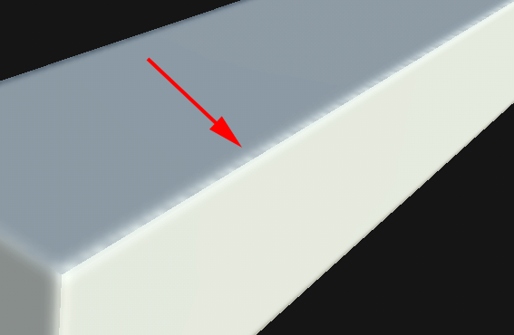
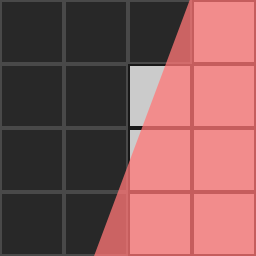
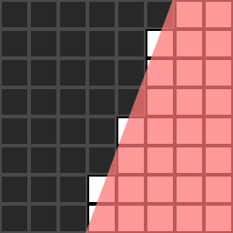

# Aliasing on UV Seams

>[!WARNING]
>
> **Issue**
> 
> Dark spots or dots appear on the border of the UV Seams after baking:
> 
> 

>[!NOTE]
>
> **Explanation**
> 
> When the Baker writes down information into the texture it has to be converted from geometry to pixels. The processing of this information may introduce [aliasing](https://en.wikipedia.org/wiki/Aliasing). Aliasing often occurs because the geometry of the UVs is not aligned with the pixel grid or because the UVs don't cover enough pixels to provide enough resolution.
> 
> In the following images the geometry is the red overlay. The baker will mark a pixel as full if more than half of its surface is covered by the geometry (white squares are full pixels and black squares are empty pixels). On the right image the pixel grid is double the resolution which allows more accurate representation of the geometry.
> 
> 
> 
> 

>[!NOTE]
>
> **Solution**
> 
> * Increase the output texture resolution of the Bakers.
> * Increase the Anti-aliasing setting (note : it may take more time to compute).
> * Align the UVs to the pixel grid in the UV editor of the 3D modeling software.
> * Give a better Texel Ratio to UVs.
