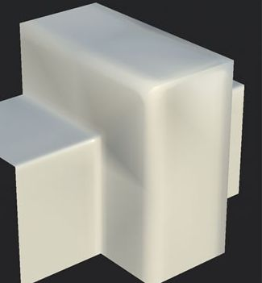

# Black shading cross is visible on the mesh surface

Black shading artifacts appear on multiple areas of the mesh when under lighting.

## Explanation

A black shaded cross usually means the normal map doesn't match the mesh, usually because the mesh geometry changed or has been computed in a way that is different from the computation performed by the baker. For example: the triangulation of the mesh is different between the baker and the viewport that renders the mesh and its normal map.

## Solution

Make sure the application showing the mesh and its normal map are synced with the way the texture has been baked. This implies:

* Verify that the Tangent Space is identical between the viewer and the baker.
* Verify that the Normal format is identical between the view and the baker.
* Verify that the Triangulation is identical between the viewer and the baker. See [this page](../../guides/triangulating-before-bak/triangulating-before-baking.md) for more information.
