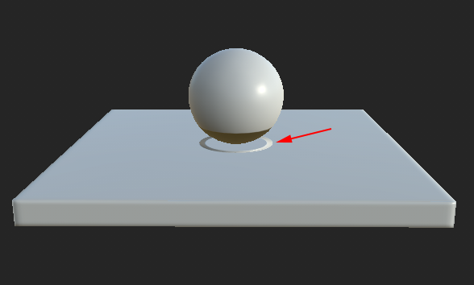

# Mesh parts bleed between each other

>[!WARNING]
>
> **Issue**
> 
> Mesh geometry bleeds on other parts and create artifacts.
> 
> 

>[!NOTE]
>
> **Explanation**
> 
> The baking process sends rays from the low-poly mesh surface to hit the high-poly mesh to create a match. Sometimes the rays go too far and hit the wrong geometry, creating the bleeding and artifacts.

>[!NOTE]
>
> **Solution**
> 
> A few solutions are available to avoid this issue :
> 
> * Use the [Matching by Name](../../features/matching-by-name/matching-by-name.md) feature to isolate the meshes
> * Use a [cage](https://helpx.adobe.com/substance-3d/unlisted/documentation/bake/cage-projection-172822982.html) to limit the ray distance.
> * Change the default ray distance in the common baker settings to a lower value.
