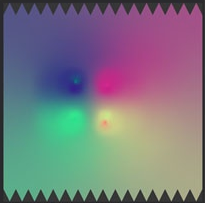
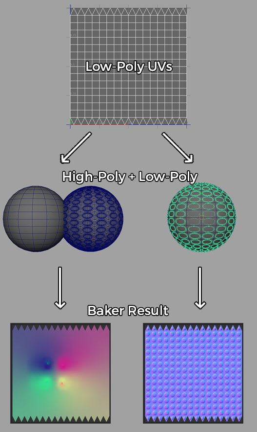

# Normal map has strange colorful gradients

The output of the baker is a set of very strong colorful gradients.

## Explanation

Colorful gradients usually happens when there is a mismatch between the high-poly and low-poly mesh during the baking process. This mismatch can be explained by the following reason :

* The high-poly and low-poly mesh <b>don&#39;t overlap</b> properly each other (see image below).
* The high-poly is <b>missing geometry</b> that the low-poly tries to cover.
* The high-poly or low-poly mesh has inverted vertex normals.

When it happens the baking process try to match geometry that doesn't exist, resulting in something empty. The baker fills this empty area with a color extracted from the neighbor pixels in the textures which creates the colorful gradient (unless <b>Diffusion</b> is disabled).

## Solution

Given the few possible reasons which lead to non-overlap between the meshes, a few solutions have to be considered :

* Make sure to freeze/reset the mesh transformation (reset x-form, etc) to be sure all the meshes are consistent
* Import both the low and high-poly mesh in your 3D modeling software to verify they overlap properly
* Make sure your naming convention is valid if you are using the [Matching By Name](../../features/matching-by-name/matching-by-name.md) feature (you can verify it by baking and then looking into the log file which should print the mesh names).

### Example

Below is an example with a high-poly and low-poly sphere. On the left the meshes don't overlap because the high-poly has been shifted away :

