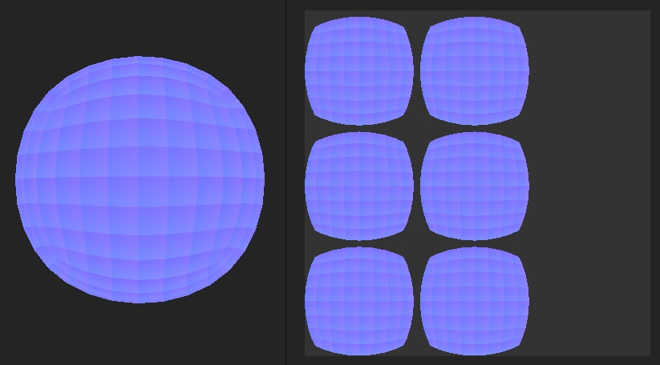

# Normal texture looks faceted

>[!WARNING]
>
> **Issue**
> 
> The Normal texture looks faceted or every face of the mesh is visible in it after baking it.
> 
> 

>[!NOTE]
>
> **Explanation**
> 
> The main reason why baking a normal would produce this result is because the low poly mesh normals are not set properly. Every edge of each faces is an hard edge, making the ray projection during the matching with the high-poly mesh ignore neighboar information and creates seams or unconscious information. While the result may look fine on the mesh, this can lead to shading issues later and should be resolved.

>[!NOTE]
>
> **Solution**
> 
> The main solution is to rework the vertex normal or the low poly mesh, the exact naming of the process depend of the 3D modeling software:
> 
> * Use **average normals** in Maya, Houdini.
> * Use **one smoothing group** in 3DS Max.
> * Use **smooth shade** in Blender.
> * Meshes exported from zBrush will be always faceted and should be cleaned up in another software.
> 
> Note that this may not be enough: make sure that the settings also save/generate the vertex normal or shading information when exporting a mesh.
