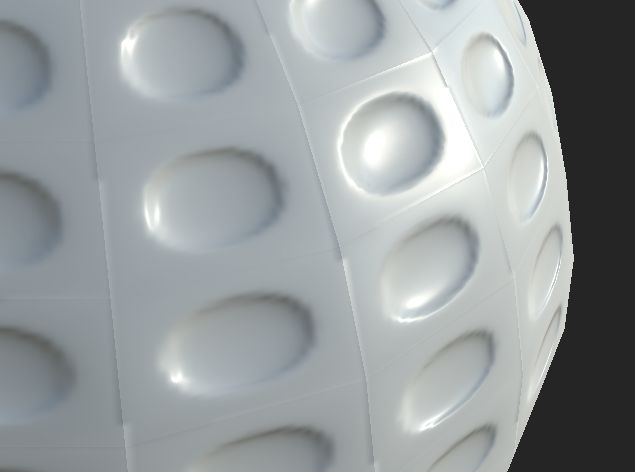

# Seam visible on every face

>[!WARNING]
>
> **Issue**
> 
> A seam is visible on a few edges of the geometry even if there are no UV seams present :
> 
> 

>[!NOTE]
>
> **Explanation**
> 
> If not using a [cage](https://helpx.adobe.com/substance-3d/unlisted/documentation/bake/cage-projection-172822982.html), the Baking process will launch rays in the direction of the vertex normals of the low-poly mesh. If each vertex normals are split (meaning each face doesn't share the same vertex normals as the neighbor face) the rays will not be send in the same direction on the edges. This result in split because the information on each side of the edges is different.
> 
> This issue is also exacerbated by aliasing, as explained in [this page](../aliasing-on-uv-seams/aliasing-on-uv-seams.md).

>[!NOTE]
>
> **Solution**
> 
> Only two solutions are possible here :
> 
> * Use a [cage](https://helpx.adobe.com/substance-3d/unlisted/documentation/bake/cage-projection-172822982.html) to control the ray direction instead of letting the baker compute it from the low-poly geometry.
> * Merge the vertex normals of the low-poly mesh together (soften them / apply a common smoothing group).
