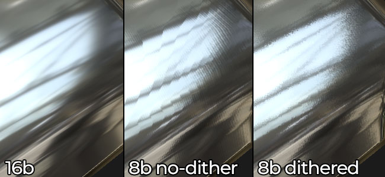

# Is dithering applied to baked textures ?

>[!WARNING]
>
> **Question**
> 
> Does the Bakers support texture [dithering](https://en.wikipedia.org/wiki/Dither) and if so when is it applied ?

>[!NOTE]
>
> **Explanation**
> 
> Dithering is applied to avoid banding in 8bit normal maps for example :
> 
> 

>[!NOTE]
>
> **Solution : Substance Designer**
> 
> Dithering is automatically applied in the following situations :
> 
> * When a Baker output is saved into an 8bit texture file
> * When a Baker output is used in a bitmap node of a graph set to 8bits.

>[!NOTE]
>
> **Solution : Substance Painter**
> 
> Dithering is an option that can be enabled or disabled during the export process. It is only applied when exporting to 8bit file format for the Normal, Displacement and Height channel.

>[!NOTE]
>
> **Solution : Substance Automation Toolkit**
> 
> Dithering is not supported at the moment.
