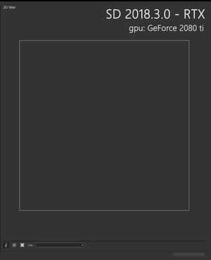

# GPU Raytracing

<table>
<tr style="border: 0;">
<td style="border: 0;" valign="top">

Some bakers support hardware acceleration of raytracing on the GPU, which usually increases computation speed by a factor of 25 or more.

## Hardware requirements

Ray tracing will automatically be enabled if the system follows these requirements:

* A compatible GPU is installed\* (RTX series, Titan V or GeForce 10xx)
* GPU drivers are up to date
* Windows 10 'Fall Creator' / October update (ver 1809) or higher is installed\*\*

</td>
<td style="border: 0;" valign="top">

{zoomable="yes"}

</td>
</tr>
</table>

\*: Compatible NVIDIA GPUs include all GPU using the Pascal architecture or more recent. I.e., the GTX 10 series, Titan V series, RTX 20 series, or more recent.

\*\*: To check your Windows version, click on the Start menu, type 'winver' and press Enter.  
You can get the update through the [dedicated page](https://support.microsoft.com/en-us/help/4028685/windows-10-get-the-update) on the Microsoft support website.

>[!TIP]
>
> In case you run into issues, GPU raytracing can be disabled in the application preferences.

## Supported bakers

The tables below lists GPU raytracing support for every baker, according to the Substance 3D bakers version:

+++Version 3 and higher

+++

+++Version 2

*: Supports CPU raytracing, which is significantly slower than GPU raytracing.

+++
