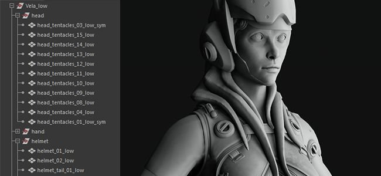
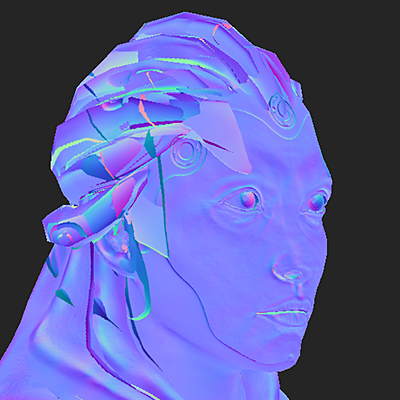
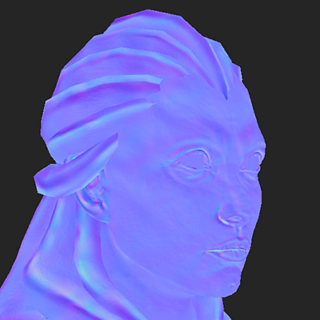
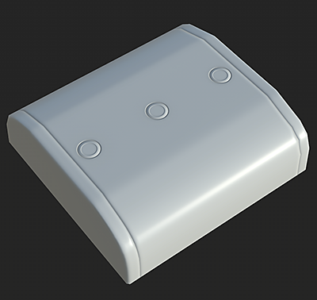
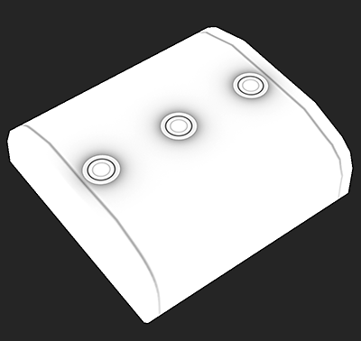
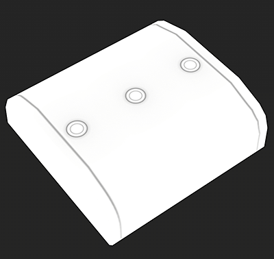
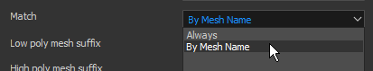

# Matching by Name

Matching By Name is the name of a filtering method that can be used in Substance Bakers to isolate low poly and high poly meshes based on their name.

This functionality is very useful to avoid geometry bleeding over each other during the baking process to achieve clean textures. It avoid having to move away meshes (often referred as "exploding") to achieve the same result.

## When to Use Matching By Name

Examples

| *Use case* | *Mesh* | *Matching By Name Off* | *Matching By Name On* |
| --- | --- | --- | --- |
| **Normal map baking with mesh bleeding.**In this example the helmet on top on the head of the character bleeds onto the character face.By enabling Matching By Name we are able to ignore the helmet and bake the face properly.*This result is based on the main Match setting.* | 

 | 

 | 

 |
| **Ignore Backface for floating geometry.**In this example the "buttons" at the top of the box are floating geometry, they are not connected to the high poly mesh. Therefore they will cast shadows by default on the box underneath them which will show the geometry border.By enabling Matching By Name for the **Ignore Backface** setting we are able to bake the ambient occlusion while ignoring the area under the buttons to make it look like one singular box.*This result is based on the use of the Ignore Backface setting.* | 

 | 

 | 

 |

## How Matching By Name Works

The Matching By Name system works by reading the geometry name in both the low and high poly meshes and using a keyword (the suffix) to identify/match the names. By default the bakers use the specific suffix but they can changed (see below).

The current suffixes supported are:

| *Suffix Type* | *Default Value* | *Usage* |
| --- | --- | --- |
| High Poly | *\_high* | Used to isolate the name of the high poly mesh to match against the low poly one. |
| Low Poly | *\_low* | Used to isolate the name of the low poly mesh to match against the high poly one. |
| Ignore Backface | *\_ignorebf* | Used to ignore backfaces for bakers using secondary rays, such as the Ambient Occlusion.*This suffix should be present on the high poly meshes only, ex: **mesh\_high\_ignorebf*** |

Some rules to take into account to make this feature work properly:

* Matching By Name has to be enabled in [Common Parameters](../../bakers-settings/common-parameters/common-parameters.md) as it is **off by default**.
* A secondary Matching By Name setting might be enabled in some bakers (such as [Ambient Occlusion](../../bakers-settings/ambient-occlusion-from/ambient-occlusion-from-mesh.md)) because they produce secondary rays.
* Matching is case sensitive, this means a mesh named "**Vela**" won't match with another one named "**vela**".
* Multiple meshes can be matched together based on where the suffix is present in the geometry name.

Below are examples of how the matching may work (using the default suffix):

| Low Poly Name | Will Match With High Poly | Will Not Match With High Poly |
| --- | --- | --- |
| <ul data-preserve-html="true"><li data-preserve-html="true">body&#95;low</li></ul> | <ul data-preserve-html="true"><li data-preserve-html="true">body&#95;high</li><li data-preserve-html="true">body&#95;high&#95;top</li><li data-preserve-html="true">body&#95;high&#95;1</li><li data-preserve-html="true">body&#95;high&#95;2</li></ul> | <ul data-preserve-html="true"><li data-preserve-html="true">body-high</li><li data-preserve-html="true">body&#95;top&#95;high</li></ul> |
| <ul data-preserve-html="true"><li data-preserve-html="true">Head&#95;low</li></ul> | <ul data-preserve-html="true"><li data-preserve-html="true">Head&#95;high</li></ul> | <ul data-preserve-html="true"><li data-preserve-html="true">head&#95;high</li></ul> |
| <ul data-preserve-html="true"><li data-preserve-html="true">Leg&#95;low&#95;top</li></ul> | <ul data-preserve-html="true"><li data-preserve-html="true">Leg&#95;high</li><li data-preserve-html="true">Leg&#95;high&#95;top</li><li data-preserve-html="true">Leg&#95;high&#95;high&#95;top</li></ul> | <ul data-preserve-html="true"><li data-preserve-html="true">Leg&#95;top&#95;high</li></ul> |

## How to setup the bakers

### Enabling Matching By Name

Matching By Name can be enabled in the [Common Parameters](../../bakers-settings/common-parameters/common-parameters.md) of the Baker settings:

| *Software* | *Setting Configuration* |
| --- | --- |
| **Substance Painter** | <ol class="steps" data-preserve-html="true"> <li class="step" data-preserve-html="true">     Open the Baking Window (via the Texture Set Settings).    </li> <li class="step" data-preserve-html="true">     Display the Common Parameters.    </li> <li class="step" data-preserve-html="true">     Change the setting <strong>Match</strong> from "Always" to "By Mesh Name".      </li> </ol> |
| **Substance Designer** | <ol class="steps" data-preserve-html="true"> <li class="step" data-preserve-html="true">     Open the Baking Window (by right-clicking on a linked mesh in the Explorer Window).    </li> <li class="step" data-preserve-html="true">     Change the setting  <strong>Match</strong>  from "Always" to "By Mesh Name".        </li> </ol> |

### Changing the Suffix Names

The default suffixes are \_low and \_high and can be changed the following way:

* **Substance Painter**: In the [Baking window](../../getting-started/software-interface/3d-painter/substance-3d-painter.md), within the common parameters.
* **Substance Designer**: In the [Project settings](https://helpx.adobe.com/substance-3d-designer/interface/preferences-window/project-settings.html), under the Bake settings.

## High-poly meshes from zBrush

High-poly meshes exported from zBrush can be used for baking with the Matching By Name feature, however some settings might be followed:

| *File format* | *Description* |
| --- | --- |
| **FBX** | No specific parameters to enable/disable, mesh files can be used as-is. |
| **OBJ** | OBJ files exported by zBrush won't work with **Matching By Name** by default. Instead, it is possible to tell Substance Painter to use the mesh filename instead to match meshes by name.To do so, make sure to:<ol data-preserve-html="true"><li data-preserve-html="true"><strong>Disable</strong> the group (Grp) parameter for <strong>each</strong> subtool.</li><li data-preserve-html="true"><strong>Name</strong> the OBJ file appropriately (ex: <strong>body&#95;high.obj</strong>).</li></ol> 

 |
