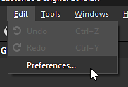
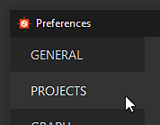
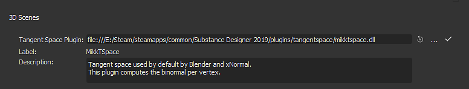

# Tangent Space

Substance Bakers can either load the Tangents and Binormals present on the low-poly mesh or recompute them. When recomputing them it is possible to define a custom Tangent Space algorithm (by default it is MikkTSpace).

## Tangent Space Plugins List

## Substance Painter

In Substance Painter the Tangent Space plugin cannot be changed, it will always be **MikkTSpace**. However there is a parameter to alter slightly its behavior to make it compatible with other applications:

| *Parameter* | *Compatible* *Application* |
| --- | --- |
| **Compute tangent space per fragment: Disabled** | Compatible with xNormal, Unity 5.3 or newer. |
| **Compute tangent space per fragment: Enabled** | Compatible with Unreal Engine 4, Blender and Unity HDRP workflow. |

## Substance Designer

Substance Designer supports the following algorithm:

| *Filename* | *Description* |
| --- | --- |
| **mikktspace.dll** | MikkTSpace, Tangent Space algorithm based on Morten S. Mikkelsen work.Compatible with xNormal, Unity 5.3 or newer. |
| **mikkunrealtspace.dll** | MikkTSpace, Tangent Space algorithm based on Morten S. Mikkelsen work.Compatible with Unreal Engine 4, Blender and Unity HDRP workflow. |
| **unitytspace.dll** | Tangent Space algorithm based on Unity 4. |

>[!NOTE]
>
> It is possible to write a custom Tangent Space plugin. A header file named **tangentspaceplugin.h** is available in the installation folder under **Substance Designer/SDK/tangentspace** and can be used as an interface.

## Setting a custom Tangent Space

## Substance Painter

Substance Painter does not support custom Tangent Space plugins at the moment. This means that if Tangents and Binormals are not present on the low-poly mesh (used to create the project) they will be recomputed based on the MikkTSpace algorithm.

## Substance Designer

To set the tangent space algorithm in Substance Designer follow these steps:

1. Choose **Edit** &gt; **Preferences**.

   
1. Click on **Projects**.

   
1. Navigate to the **General** tab. Scroll until the section **3D Scenes** is visible.

   
1. Click on the **three dots** (...) to load a custom plugin.

## Substance Automation Toolkit

When baking with the Automation Toolkit it is possible to specify the Tangent Space plugin with a specific command line argument:

```

sbsbaker normal-from-mesh --tangent-space-plugin "C:/Substance Designer/plugins⁄tangentspace⁄mikktspace.dll" ...
```
