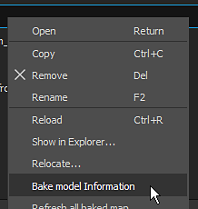
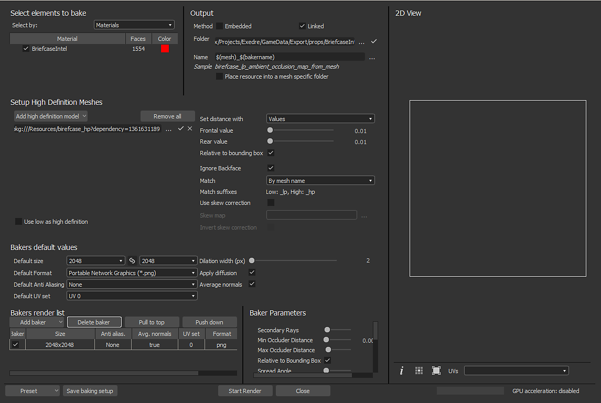
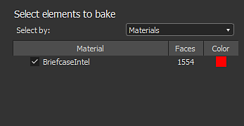
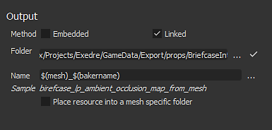
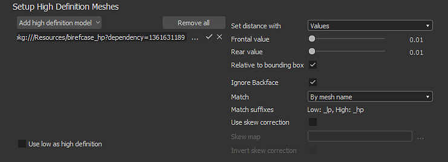
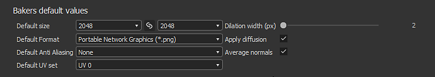
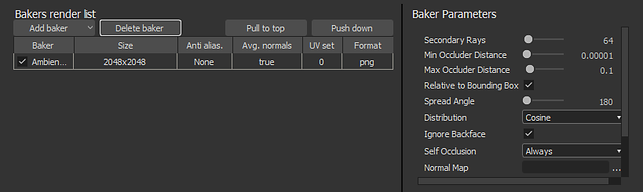

# Substance 3D Designer

The baking window can be accessed via the mesh file in the [Explorer](https://helpx.adobe.com/substance-3d/unlisted/documentation/sddoc/the-explorer-129368147.html) window. Right-Click on the mesh name and choose "**Bake Model Information**" to open the baking window.

## Overview

{width="500px"}

The baking window of is divided into several panels which are described below.

### Element to Bake

This panel controls which part of the low-poly mesh will be used to perform the baking.

This panel will list the geometry found inside the low-poly mesh file. By default the list is based on the individual materials found in the file, but it can be switched to sub-meshes instead when relevant. You can uncheck elements that should be ignored during the baking process.

### Output

This panel controls where the baked texture will be located.

| *Parameter* | *Description* |
| --- | --- |
| **Method** | Controls how the baked textures will be stored with the Substance package.Possible values:<ul data-preserve-html="true"><li data-preserve-html="true"><strong>Embedded</strong> : the baked texture are stored in a sub-folder next to the Substance package with specific naming.</li><li data-preserve-html="true"><strong>Linked</strong> (default) : the baked texture are stored in the folder defined and then referenced into the Substance packaged.</li></ul> |
| **Folder** | Location of the baked textures when saved. Click on three dots button to open a file dialog and choose the export folder.A check-mark will be visible on the right to indicate if the folder actually exist or not. |
| **Name** | Naming convention of the baked textures. Click on three dots button to open a dropdown and insert other placeholders (bakename, custom, material, mesh). |
| **Sample** | Simulate a filename to test the naming convention. |
| **Place Resource Into a Mesh Specific Folder** | If enabled, the baked textures will be saved inside a folder named as the mesh file. |

### High Definition Meshes

This panel controls the high-poly mesh list and the related settings. See the [common parameters](../../../bakers-settings/common-parameters/common-parameters.md) for more information.

### Default Values

See the [common parameters](../../../bakers-settings/common-parameters/common-parameters.md) for more information.

### Baker List and Settings

The baker is where you can choose which baked texture you want to generate. By default the list is empty.

* **Adding a new baker:** Click on button "Add Baker".
* **Removing a baker:** Select the baker in the list, then click on the button "Delete baker".
* **Moving a baker to the top:** Select the baker in the list, then click on the button "Pull to top".
* **Moving down a baker:**Select the baker in the list, then click on the button "Push down".

Each baker in the inherit by default the Default Values (see above). The size (resolution) for example can be overridden by clicking on the cell on the line of the baker. This is true for the other settings on the line.

When clicking on a baker in the list, the Baker Parameters view will update with its specific parameters.

To learn more about the specific parameters, see: [Bakers Settings](../../../bakers-settings/bakers-settings.md).
