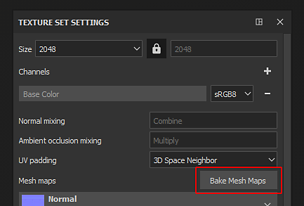
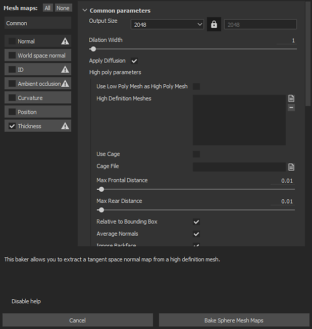
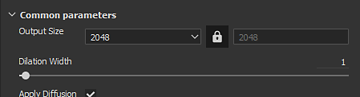
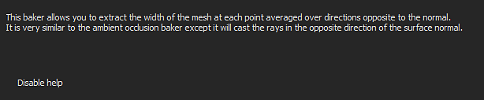

# Substance 3D Painter

The baking window can be accessed via the [Texture Set Settings](https://helpx.adobe.com/substance-3d-painter/interface/texture-set/texture-set-settings.html). Click on the button named "**Bake Mesh Maps**" to open the baking window of the current project.

## Overview

{width="400px"}

The baking window is divided into three main components.

### Baker List

At the top left of the window are available several buttons.

Next to those button is a checkbox, if it is checked it will enable this baking for the baking process. The buttons that have an icon next to their names indicates the ones that need an high-poly mesh. This icon display a warning if there are now high-poly available.

| *Button* | *Description* |
| --- | --- |
| **Common** | Change the parameters view to the [Common parameters](../../../bakers-settings/common-parameters/common-parameters.md). |
| **Normal** | Change the parameters view to the [Normal parameters](../../../bakers-settings/normal-map-from-mesh/normal-map-from-mesh.md). |
| **World Space Normal** | Change the parameters view to the [World Space Normal parameters](../../../bakers-settings/world-space-normals/world-space-normals.md). |
| **ID** | Change the parameters view to the [Color parameters](../../../bakers-settings/color-map-from-mesh/color-map-from-mesh.md). |
| **Ambient Occlusion** | Change the parameters view to the [Ambient Occlusion parameters](../../../bakers-settings/ambient-occlusion-from/ambient-occlusion-from-mesh.md). |
| **Curvature** | Change the parameters view to the [Curvature parameters](../../../bakers-settings/curvature/curvature.md). |
| **Position** | Change the parameters view to the [Position parameters](../../../bakers-settings/position/position.md). |
| **Thickness** | Change the parameters view to the [Thickness parameters](../../../bakers-settings/thickness-map-from-mesh/thickness-map-from-mesh.md). |
| **Height** | Change the parameters view to the [Height parameters](../../../bakers-settings/height-map-from-mesh/height-map-from-mesh.md). |
| **Bent normals** | Change the parameters view to the [Bent normals parameters](../../../bakers-settings/bent-normals-from-mesh/bent-normals-from-mesh.md). |
| **Opacity** | Change the parameters view to the [Opacity parameters](../../../bakers-settings/opacity-mask-from-mesh/opacity-mask-from-mesh.md). |

### Parameters

This part of the window displays the various baking settings. Its content can change depending of the currently selected baker or common parameters.

To learn more about the baker settings see the [Baker Settings](../../../bakers-settings/bakers-settings.md).

### Help Message

{width="500px"}

This part of the window shows the various tooltips and help message related to the settings. Move the mouse over a setting to read its tooltip here.
