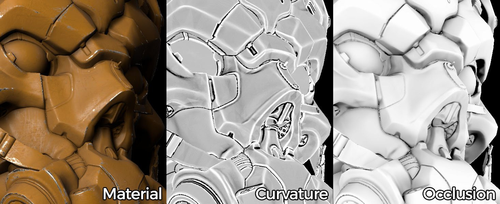

# What is Baking ?

> 

&#40;Credits: &#91;Paolo Cignoni&#93;&#40;https://commons&#46;wikimedia&#46;org/wiki/File:Normal&#95;map&#95;example&#46;png&#41; &#45; &#91;CC BY&#45;SA 1&#46;0&#93;&#40;https://creativecommons&#46;org/licenses/by&#45;sa/1&#46;0&#41;&#41;

Baking is the name of the process about **saving information** related to a **3D mesh** into a **texture** file ([bitmap](https://en.wikipedia.org/wiki/Raster_graphics)). Most of the time this process involve another mesh. In this case the information of the first mesh are transferred onto the second mesh UVs and then saved into a texture.

While some application may support baking information into the mesh properties (such as vertex colors), Substance Bakers only allow to bake information down to a texture. However they can read mesh properties and bake them down to textures (like vertex colors).

## Is baking necessary ?

Substance software generate textures and these textures can be enhanced by using information related to the mesh geometry.  
Many filters and materials can adapt to the specific geometry of a 3D mesh by looking at the baked textures. Baking can provide information about where ambient shadows can be, where are the edges of the geometry and much more.

For example : an old car may have rust applied at its bottom because it didn't move for a while. Baking the position map will allow to know where the bottom is on the mesh which will feed the rust generator and produce the adapted texture.

{width="500px"}

## How does baking work ?

Each baker performs specific actions in order to generate their own result, but in general the baking process involves two possible methods:

* **Baking onto one mesh** : relies on the current mesh to generate information.
* **Baking from one mesh to another one** : compute information from a source mesh and transfert the result onto another one.

This baking process relies on the mesh properties, which is why the mesh must be clean and exempt of any possible faults in its geometry.

## What kind of information can you bake ?

Many type of information can be baked down. However in general only a specific set is needed because they can be extrapolated to create more advanced result later. This is why there are common type of baking process that can be found in multiple software.

As an example Substance software can output the following kind of information :

* **Ambient occlusion** (ambient shadows)
* **Normal** information (surface details variations stored as vector directions)
* **Direction** (where is up or down, left or right, etc)
* **Curvature** (edges and cavities of the geometry)
* **Position** (relative position of the geometry inside a normalized cube)

Refer to the [documentation of each baker](../../bakers-settings/bakers-settings.md) for further information.

## Difference Between 'regular' and 'from mesh' Bakers

Depending on the process the bakers use various implementations. Generally speaking, the **from mesh** bakers rely on ray tracing techniques to extract and project data from one model to another.
