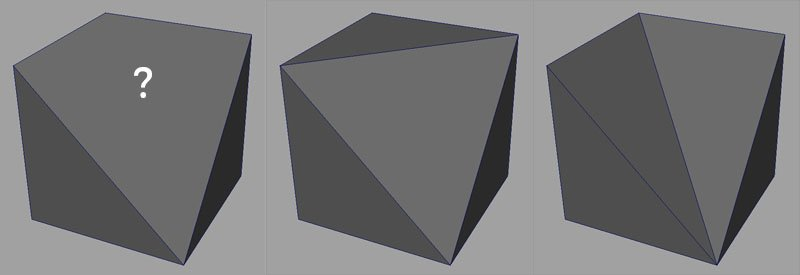
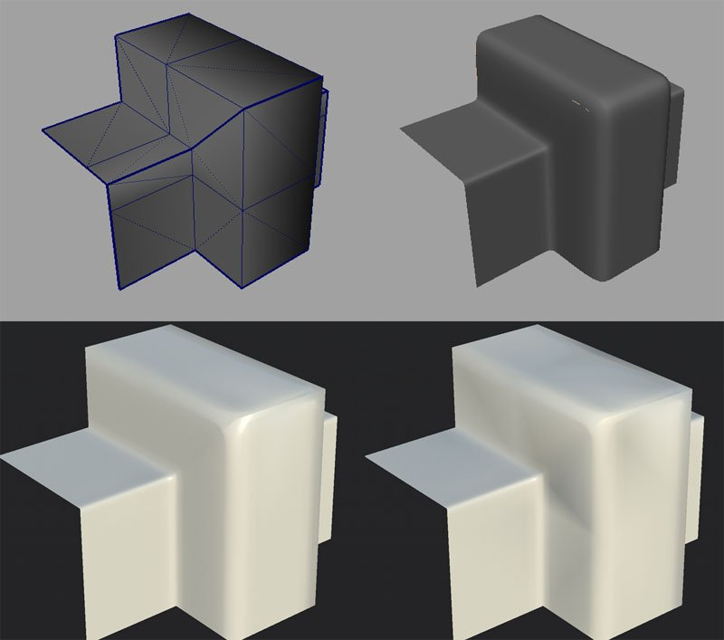

# Triangulating before baking

3D Meshes can be defined with polygons with multiple border edges per face. Usually via quads (4 edges), sometimes more (n-gons).  
Software however transform those polygons into Triangles later because it's easier to manage and perform computation with (especially on the GPU).

## How can triangulation affect a mesh ?

There are **no standard solutions** to convert Quad/N-Gons into triangles. As demonstrated on the image above, multiple choices are valid.  
The bakers are unlikely to triangule meshes like a game engine would do because we choose a specific algorithm over an other.

## Why triangulating before baking ?

The baking process will read the geometry and then encode information into textures.  
Because those information are based on UVs and sometimes on the mesh topology, other software could decode the information incorrectly if they don't read the geometry the same way as when they apply the texture.

On the image below, you can see the low-poly mesh at the top left and the high-poly mesh at the top right.  
At the bottom is the low-poly with the normal map baked from the high-poly. The mesh on the left use a triangulation identical to the one used by Substance Painter when baking. The mesh on the right doesn't and display black artifacts. This is because there is a mismatch between how the normal map was baked and how the mesh is currently triangulated. This can be fixed by **updating the mesh and/or rebaking**.

