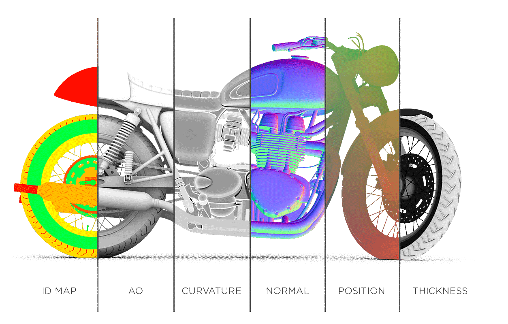

# Substance Bakers

<table>
<tr style="border: 0;">
<td width="41.60%" style="border: 0;" valign="top">

The <b>Substance Bakers</b> are a toolset of advanced algorithm to compute mesh based information into texture files. They can be used by any artist with a 3D mesh to take advantage of advanced texturing methods. Baking is a process at the core of the Substance software workflow in order to offer<b> powerful tools</b> and <b>automated texturing</b>.

This documentation covers the <b>fundamentals of baking</b> and the <b>common issues</b> and mistakes that can be encountered when dealing with this process.

</td>
<td width="58.30%" style="border: 0;" valign="top">

{width="400px"}

</td>
</tr>
</table>

<table>
<tr style="border: 0;">
<td style="border: 0;" valign="top">

## Getting Started

* [What is Baking ?](../getting-started/what-is-baking/what-is-baking.md)
* Bake with:
  * [Substance 3D Painter](../getting-started/software-interface/3d-painter/substance-3d-painter.md)
  * [Substance 3D Designer](../getting-started/software-interface/3d-designer/substance-3d-designer.md)
  * [Substance 3D Automation Toolkit](../getting-started/software-interface/3d-automation-toolkit/substance-3d-automation-toolkit.md)
* [Availability per software](../getting-started/availability-per-software/availability-per-software.md)
* [Compatible 3D software](../getting-started/compatible-3d-software/compatible-3d-software.md)
* [Tutorials](../getting-started/tutorials/tutorials.md)

</td>
<td style="border: 0;" valign="top">

### Bakers Settings

* [Common Parameters](../bakers-settings/common-parameters/common-parameters.md)
* [Ambient Occlusion](../bakers-settings/ambient-occlusion/ambient-occlusion.md)
* [Ambient Occlusion from Mesh](../bakers-settings/ambient-occlusion-from/ambient-occlusion-from-mesh.md)
* [Bent Normals from Mesh](../bakers-settings/bent-normals-from-mesh/bent-normals-from-mesh.md)
* [Color Map from Mesh](../bakers-settings/color-map-from-mesh/color-map-from-mesh.md)
* [Convert UV to SVG](../bakers-settings/convert-uv-to-svg/convert-uv-to-svg.md)
* [Curvature](../bakers-settings/curvature/curvature.md)
* [Curvature from Mesh](../bakers-settings/curvature-from-mesh/curvature-from-mesh.md)
* [Curvature from Mesh (deprecated)](../bakers-settings/curvature-from-mesh-dep/curvature-from-mesh-deprecated.md)
* [Height Map from Mesh](../bakers-settings/height-map-from-mesh/height-map-from-mesh.md)
* [Normal Map from Mesh](../bakers-settings/normal-map-from-mesh/normal-map-from-mesh.md)
* [Opacity Mask from Mesh](../bakers-settings/opacity-mask-from-mesh/opacity-mask-from-mesh.md)
* [Position](../bakers-settings/position/position.md)
* [Position map from Mesh](../bakers-settings/position-map-from-mesh/position-map-from-mesh.md)
* [Thickness Map from Mesh](../bakers-settings/thickness-map-from-mesh/thickness-map-from-mesh.md)
* [Transferred Texture from Mesh](../bakers-settings/transferred-texture-from/transferred-texture-from-mesh.md)
* [World Space Direction](../bakers-settings/world-space-direction/world-space-direction.md)
* [World Space Normals](../bakers-settings/world-space-normals/world-space-normals.md)

</td>
<td style="border: 0;" valign="top">

### Guides

* [Error and Warning Messages](../guides/error-and-warning-mes/error-and-warning-messages.md)
* [Performances and optimizations](../guides/performances-and-opt/performances-and-optimizations.md)
* [Triangulating before baking](../guides/triangulating-before-bak/triangulating-before-baking.md)

</td>
</tr>
</table>

<table>
<tr style="border: 0;">
<td style="border: 0;" valign="top">

### Features

* [Geometry Cache](../features/geometry-cache/geometry-cache.md)
* [GPU Raytracing](../features/gpu-raytracing/gpu-raytracing.md)
* [Matching by Name](../features/matching-by-name/matching-by-name.md)
* [Tangent Space](../features/tangent-space/tangent-space.md)

</td>
<td style="border: 0;" valign="top">

### Common Questions

* [How to export the baked maps ?](../common-questions/how-export-the-baked-maps/how-to-export-the-baked-maps.md)
* [Is dithering applied to baked textures ?](../common-questions/dithering-applied-baked/is-dithering-applied-to-baked-textures.md)
* [Should I enable "Compute tangent space per fragment" ?](../common-questions/should-enable-compute-tan/should-i-enable-compute-tangent-space-per-fragment.md)
* [Texture baked outside of Substance software looks incorrect](../common-questions/texture-baked-outside-sof/texture-baked-outside-of-substance-software-looks-incorrect.md)
* [What are Assbin files ?](../common-questions/what-are-assbin-files/what-are-assbin-files.md)
* [What is the bit depth of baked textures ?](../common-questions/what-the-bit-depth-baked/what-is-the-bit-depth-of-baked-textures.md)
* [What is the difference between the OpenGL and DirectX normal format ?](../common-questions/what-the-difference-bet/what-is-the-difference-between-the-opengl-and-directx-normal-format.md)
* [Why are there strange stretches in my textures after baking or exporting ?](../common-questions/why-are-there-strange-str/why-are-there-strange-stretches-in-my-textures-after-baking-or-exporting.md)
* [Why is Matching by Name not working with Ambient Occlusion/Thickness ?](../common-questions/why-matching-name-not-wor/why-is-matching-by-name-not-working-with-ambient-occlusion-thickness.md)
* [Why is my mesh fully black after baking ?](../common-questions/why-mesh-fully-black-aft/why-is-my-mesh-fully-black-after-baking.md)

</td>
<td style="border: 0;" valign="top">

### Common Issues

* [Aliasing on UV Seams](../common-issues/aliasing-on-uv-seams/aliasing-on-uv-seams.md)
* [Baker output is fully black or empty](https://helpx.adobe.com/substance-3d/unlisted/documentation/bake/baker-output-is-fully-black-159451835.html)
* [Baking failed with Color Map from Mesh](../common-issues/baking-failed-with-color/baking-failed-with-color-map-from-mesh.md)
* [Black shading cross are visible on the mesh surface](../common-issues/black-shading-cross-are/black-shading-cross-are-visible-on-the-mesh-surface.md)
* [Mesh parts bleed between each other](../common-issues/mesh-parts-bleed-between/mesh-parts-bleed-between-each-other.md)
* [Normal map has strange colorful gradients](../common-issues/normal-map-has-strange/normal-map-has-strange-colorful-gradients.md)
* [Normal texture looks faceted](../common-issues/normal-texture-looks-fac/normal-texture-looks-faceted.md)
* [Seams are visible after baking a normal texture](../common-issues/seams-are-visible-after/seams-are-visible-after-baking-a-normal-texture.md)
* [Seam visible on every face](../common-issues/seam-visible-every-face/seam-visible-on-every-face.md)

</td>
</tr>
</table>
