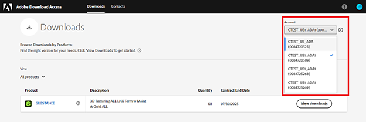
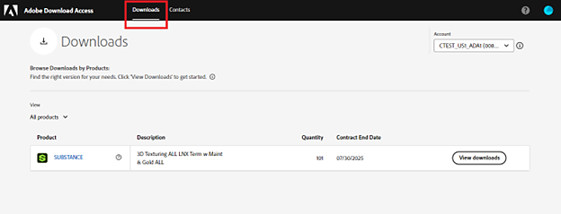
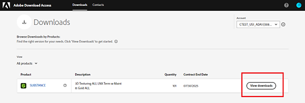
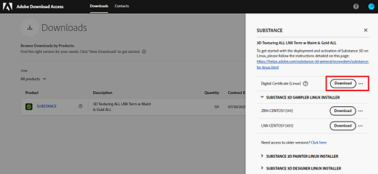
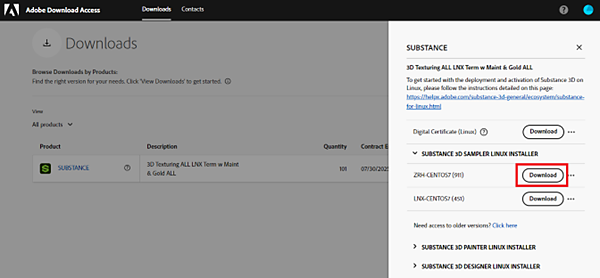
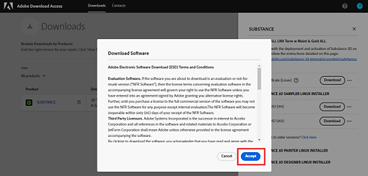

# Deployment guide

After purchasing Substance 3D for Linux® via your Enterprise contract, the corresponding products and licenses are provisioned on the [Adobe Download Access (ADA)](https://download-access.adobe.com/lws/downloads) portal. You'll need to download both the software builds and the license key files from ADA to deploy the software successfully.

## Download software builds and license key files:

Sign in to [Adobe Download Access](https://download-access.adobe.com/lws/downloads). Find the software builds and license key files:

1. Use the Account dropdown to select the account on which you purchased Substance 3D Linux.

   
1. Navigate to Downloads with the link in the page header.

   
1. Click View downloads on the corresponding product.

   
1. ADA will load the license information associated with this ID and display it in the table below.
1. Click "Download" on the "Digital Certificate" line to download the zip file containing the license key files.

   * The zip file contains one license key per product.
   * The license key will activate the product on each of your licensed machines.

   
1. Click "Substance 3D" Sampler, Painter, or Designer to display the software builds of Substance 3D Painter, Substance 3D Designer, and Substance 3D Sampler.
1. Click "Download" to download the installation file of the product you would like to install.

   
1. A “Download Software” notification will pop up. Click “accept”

   

## Installation and activation

To install the software:

1. Double click the product's EXE file to start the installation wizard.
1. Follow the installation steps to complete the installation.

There are two options for software activation, either local activation or network activation.

### Local activation

1. Unzip the zip folder downloaded from ADA.
1. Launch the software that you want to activate.
1. In the activation wizard, select "Activate using a license key file".

   
1. Click "Browse", and point to the location of the corresponding license key file.
1. Click "Next" to activate the software.

### Network activation

1. Unzip the zip folder downloaded from ADA.
1. Place the unzipped license key files on a shared mounted network.
1. On your user's machine, set up an environment variable pointing to the license key file as explained on these pages:

   * Substance 3D Painter - <https://helpx.adobe.com/substance-3d-painter/pipeline-and-integration/configuration/environment-variables.html>
   * Substance 3D Designer - <https://helpx.adobe.com/substance-3d-designer/pipeline-and-project-configuration/environment-variables.html>
   * Substance 3D Sampler - <https://helpx.adobe.com/substance-3d-sampler/pipeline-and-integrations/environment-variables.html>
