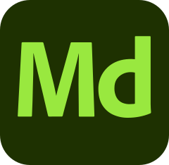
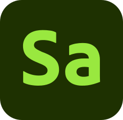
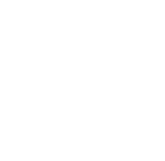
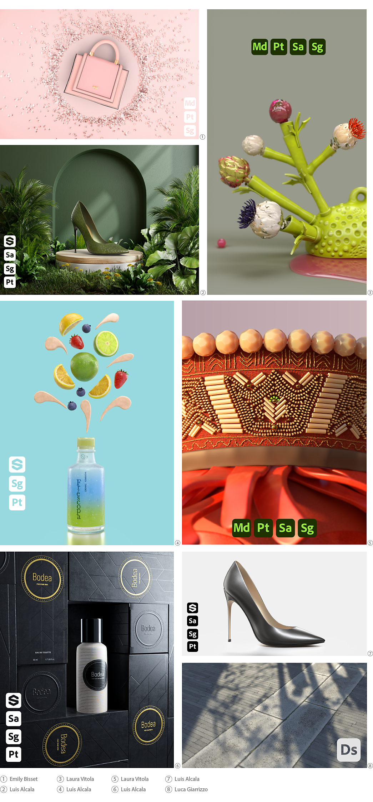

# Substance 3D icons for artists

<table>
<tr style="border: 0;">
<td style="border: 0;" valign="top">

{width="64px"}

</td>
<td style="border: 0;" valign="top">

{width="64px"}

</td>
<td style="border: 0;" valign="top">

{width="64px"}

</td>
<td style="border: 0;" valign="top">

{width="64px"}

</td>
<td style="border: 0;" valign="top">

{width="64px"}

</td>
<td style="border: 0;" valign="top">

{width="64px"}

</td>
</tr>
</table>

Artists who wish to include Substance 3D applications' icons in their published artwork may download them below. The images use the SVG format, so they may be used at any scale.

Right-click on an image and select the 'Save as...' action to download an icon.

+++Color
{width="128px"}

{width="128px"}

{width="128px"}

{width="128px"}

{width="128px"}

{width="128px"}

+++

+++White
{width="128px"}

{width="128px"}

{width="128px"}

{width="128px"}

{width="128px"}

{width="128px"}

+++

+++Black
{width="128px"}

{width="128px"}

{width="128px"}

{width="128px"}

{width="128px"}

{width="128px"}

+++

## Creative Cloud Library

Creative Cloud users can access these icons in Creative Cloud applications through this shared library:

[Substance 3D icons](https://shared-assets.adobe.com/link/4c83a12c-3948-4151-5be1-ad75f4a64be0)

## Examples

