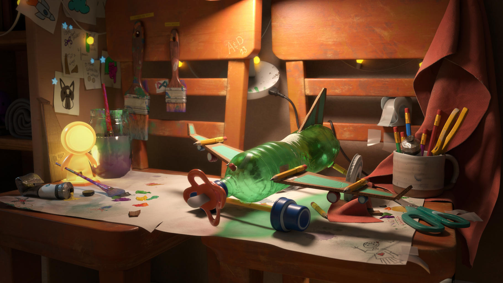
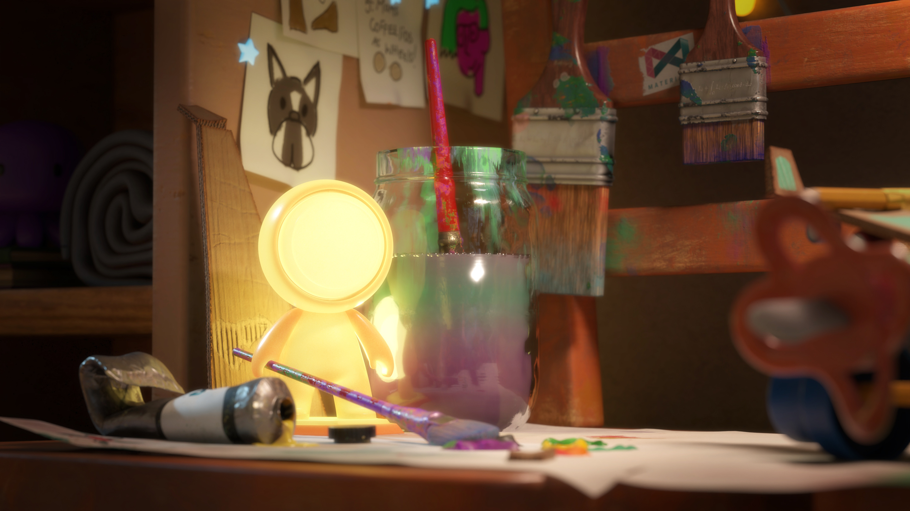
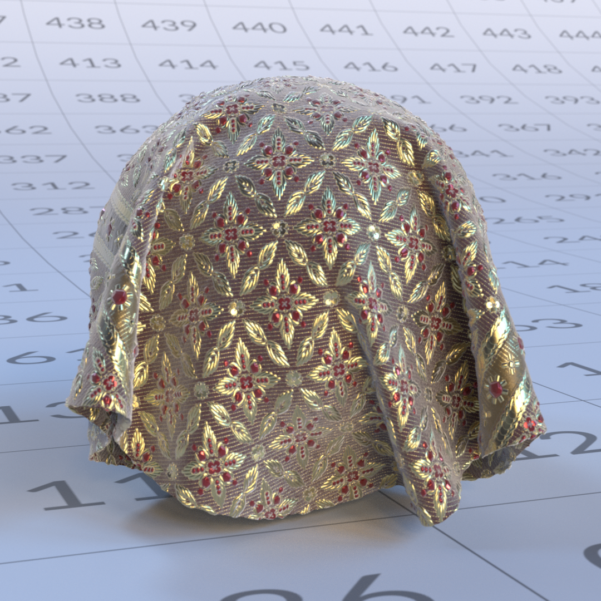
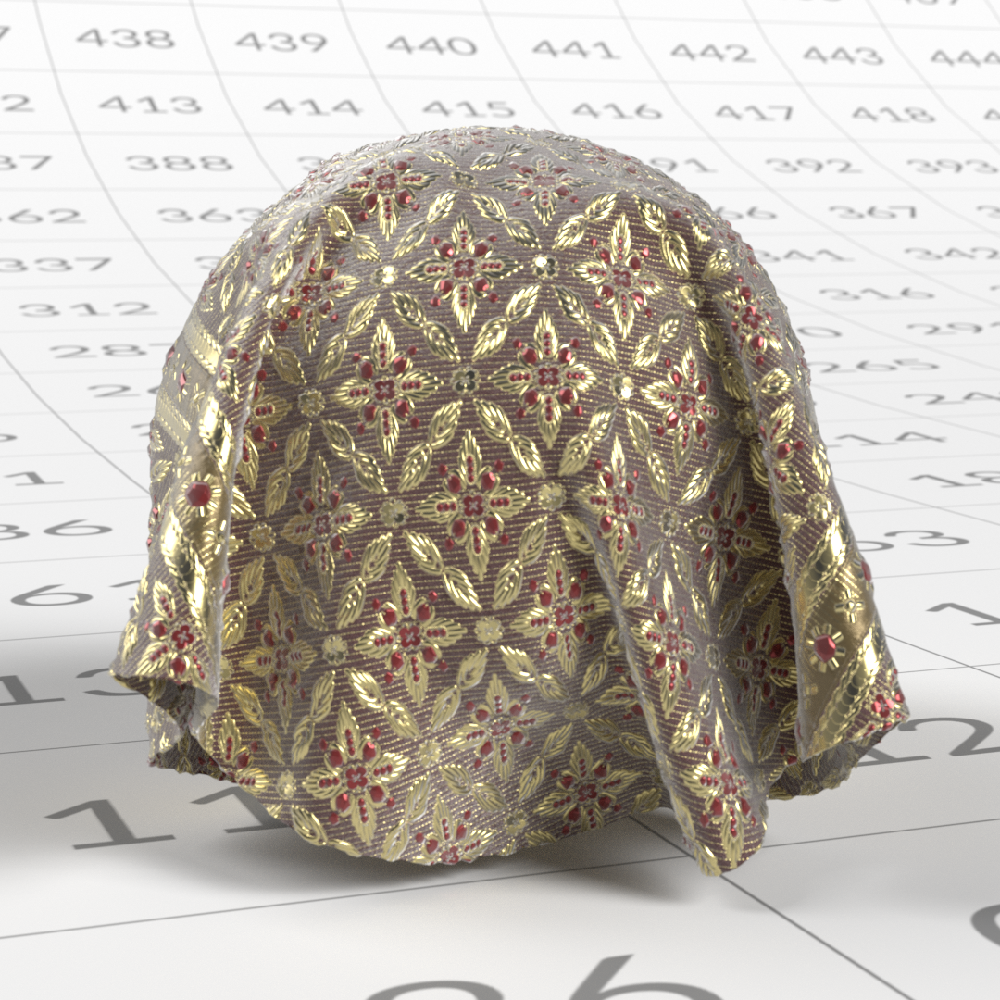
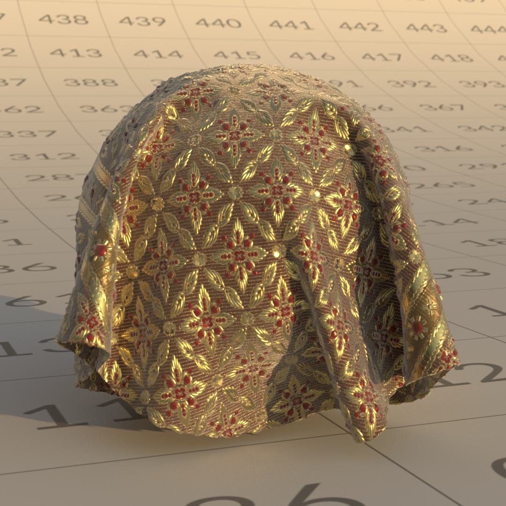
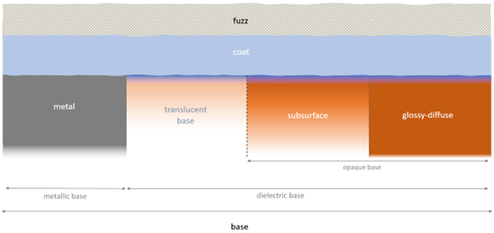
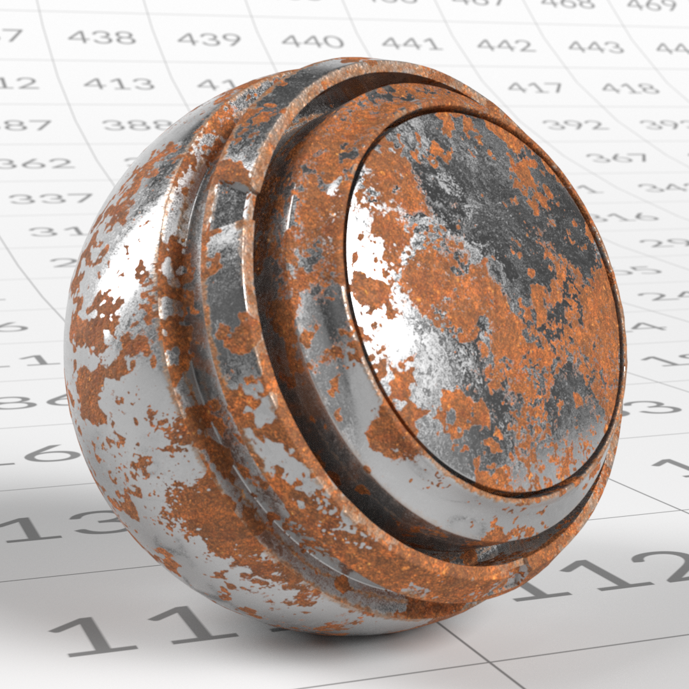
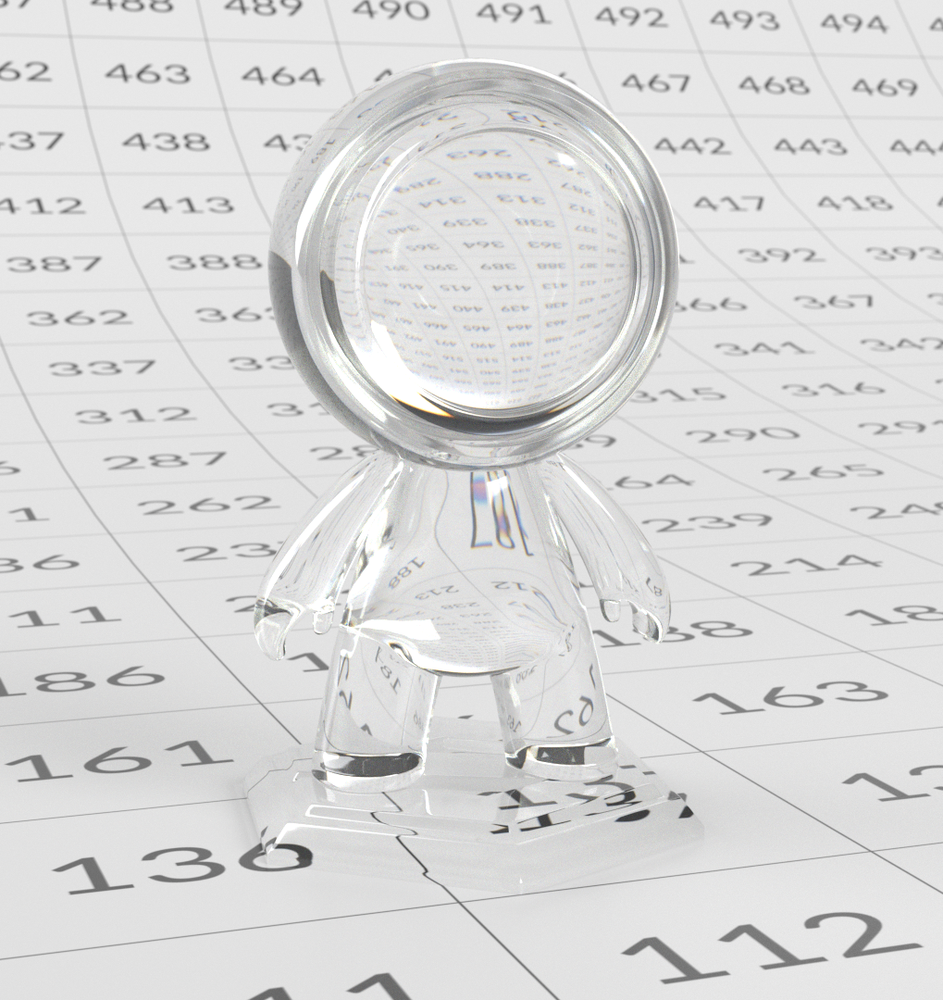
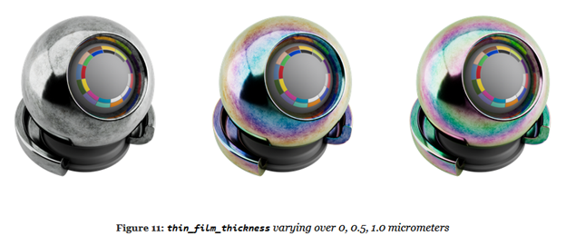

# OpenPBR

**OpenPBR** is an open, physically based surface shading model designed to provide a consistent and predictable way to describe materials across different 3D tools, renderers, and pipelines. It defines a single, comprehensive material model capable of representing a wide range of real-world surfaces, while remaining flexible enough to support more stylized or artist-driven looks using physically meaningful parameters.

The model addresses long-standing inconsistencies between "standard" shaders that behave similarly in name but differ in parameter definitions and physical assumptions across applications. Grounded in the principles of physically based rendering, OpenPBR describes materials in terms of real-world light behavior, emphasizing energy conservation, intuitive parameter ranges, and stable lighting responses. Rather than prescribing a specific user interface, OpenPBR defines how materials behave at a fundamental level, allowing tools to implement the model in their own way while preserving consistent visual results as assets move between applications and pipelines.

This document is an artist-focused guide to understanding and working with OpenPBR. It explains the model's underlying principles, how its components describe real-world light behavior, and how those ideas translate into practical material creation. Rather than focusing on a specific application, the guide is intended for 3D artists working in areas including look development, texturing, and rendering who want to build robust, physically plausible materials that remain consistent and transferable across different software environments.

## Interoperability and file standards

### A shared material language with OpenPBR

One of the core goals of OpenPBR is to improve how materials move between tools. Rather than being a shader tied to a single renderer or application, OpenPBR defines a **shared shading model** – a common way of describing how a material responds to light.

For artists, this means that an OpenPBR material is not just, for instance, 'an Adobe material' or 'an Autodesk material,' but rather a description of surface and volume behavior that can, in principle, be understood by multiple tools. The intent is that a material authored in one application can be interpreted consistently elsewhere, as long as those tools support the OpenPBR model.

### The asset interchange problem

The OpenPBR specification explicitly acknowledges a long-standing challenge in production: **materials do not travel well between applications**. Different renderers often use different parameter names, shading assumptions, and underlying models, which makes appearance matching difficult and time-consuming.

OpenPBR is designed as a response to this problem. By defining a single, physically grounded material model that covers common production needs – metals, dielectrics, layered materials, transmission, scattering – it provides a stable target for interchange. While this does not guarantee perfect visual matches in every situation, it significantly reduces ambiguity compared to proprietary shader models.

For artists, the practical takeaway is that OpenPBR aims to preserve *intent*. Even when exact visual parity is not possible, the structure of the material – what is metal, what is transmissive, how rough or anisotropic a surface is – remains clear and transferable.

### Relationship to MaterialX

OpenPBR is closely tied to **MaterialX**, an industry-standard framework for describing materials and looks in a renderer-agnostic way. OpenPBR's reference implementation lives within MaterialX, which means OpenPBR materials can be represented using an established interchange format already supported across many pipelines.

This relationship is important because OpenPBR itself is **not a file format**. Instead, it defines *what* a material is, while MaterialX provides a standardized way to *store and exchange* that material between tools. In practice, this allows OpenPBR materials to be embedded in broader scene descriptions and shared across DCCs and renderers that support MaterialX.

For artists, this usually happens under the hood – but it explains why OpenPBR materials are increasingly described as 'portable' or 'interoperable' in modern pipelines.

### What interoperability does, and doesn't, mean

It's important to set realistic expectations around interoperability. OpenPBR does not promise that a material will look identical in every application. Differences in lighting, rendering algorithms, color management, and feature support can still affect the final image.

What OpenPBR does provide is a common baseline: a consistent set of parameters and behaviors, a shared understanding of how materials are constructed, and a clearer path for transferring materials between tools without rebuilding them from scratch.

For artists, this means fewer surprises when assets move between departments or applications, and a workflow that emphasizes durable material logic rather than tool-specific tricks.

### Practical Implications for Artists

From a day-to-day perspective, working with OpenPBR encourages habits that naturally support interoperability:

* Thinking in terms of light behavior rather than application-specific material types
* Using physically meaningful parameters (metalness, roughness, transmission, scattering)
* Avoiding reliance on undocumented or renderer-specific solutions

Even when materials never leave a single application, these practices align with modern pipeline standards — making assets more future-proof as tools and renderers evolve.

## Material types

### Materials defined by interaction with light

OpenPBR is a monolithic model (an 'uber-shader') intended to represent a wide range of material types; such types are described in terms of how light interacts with them. Rather than defining materials in terms of fixed presets such as, for instance, 'glass' or 'skin', each OpenPBR material is built from a model of horizontal and vertical layering, which allows artists to blend together fully defined and physically meaningful characteristics – such as diffuse reflection, specular reflection, transmission, subsurface scattering, and layering. Different combinations of these behaviors naturally produce familiar real-world materials.

<table>
  <tr>
    <td style="border: 0;" valign="top"></td>
    <td style="border: 0;" valign="top"></td>
    <td style="border: 0;" valign="top"></td>
  </tr>
</table>

This approach uses a fixed model which defines in advance the framework of layering and mixing, thereby circumventing any requirement for the artist to create a shading network on a case-by-case basis, and allows OpenPBR to represent both simple and complex materials in a consistent, physically grounded way.

### Core Material Behaviors

Although OpenPBR does not impose strict material types, most real-world materials fall into a few broad behavioral categories. Understanding these categories can help establish a solid mental model for building materials.

### Dielectric (Non-Metal) Materials

Dielectrics are non-metal materials such as plastic, wood, stone, fabric, rubber, and skin. Their defining characteristics are:

* A visible diffuse component
* Mostly colorless (white) specular reflections
* Reflectivity controlled primarily by the Index of Refraction (IOR)
* No metallic reflection behavior Key parameters for dielectric materials:
* Base Color defines the overall color of the material
* Specular Color influences the tint of specular highlights (most prominent at grazing angles)
* Specular Roughness controls how sharp or blurred specular highlights appear
* Specular Weight scales the overall intensity of specular highlights For dielectric materials, the diffuse reflection dominates the appearance of the surface and is controlled by the Base Color. Specular reflections are limited at normal incidence, and increase toward grazing angles, but remain untinted.

### Metallic Materials

Metallic materials — such as steel, aluminum, copper, or gold — behave fundamentally differently from non-metallic (dielectric) materials. For metals, appearance is driven almost entirely by specular reflection: unlike dielectrics, metals have no diffuse component, and light does not scatter beneath the surface but is reflected directly. Their defining characteristics are:

* No diffuse component — color comes entirely from reflection
* Colored specular reflections
* Surface detail, especially roughness, plays a major role in appearance Key parameters for metallic materials:
* Base Color controls the color of reflections
* Specular Roughness controls how sharp or blurred those reflections appear
* Specular Weight scales reflection intensity

### Base Metalness

Base Metalness defines whether a material behaves as a dielectric or a metal — this is not just a visual adjustment, but a change in the underlying light response of the material.

* **0** → fully non-metallic (diffuse + specular)
* **1** → fully metallic (specular only)
* **0–1** → a blend of both behaviors Intermediate values are best used for material mixtures such as dirt, corrosion, or worn surfaces, rather than "partially metallic" materials.

### Practical Guidelines

* Use **0** or **1** for most materials
* Use mid-values only for mixed surfaces
* Rely on roughness and surface detail to shape metallic appearance Use layering (e.g. Coat) instead of lowering metalness for painted or coated metals Transparent and Transmissive Materials

Transparent and transmissive materials allow light to pass through them. Common examples include glass, many liquids, and clear or tinted plastics. Their defining characteristics are:

* Light enters the surface and exits the opposite side
* Thickness strongly affects appearance
* Refraction controlled by the Index of Refraction (IOR) and affected by the surface roughness
* Refraction, absorption, scattering, and dispersion shape the final look

Transmission describes how light travels through an object. Thicker areas appear darker or more saturated, while thinner areas appear clearer. Parameters such as Transmission Color, Transmission Depth, Scatter Color, and Dispersion work together to control this behavior.

A point of distinction between the terms 'transparent' and 'transmissive': 'transparent' is a real-life, everyday term; something is transparent if we can see through it. 'Transmissive' is a synonym of 'translucency'. Frosted glass, for example, allows light to pass through it (and so, it is transmissive), but it isn't transparent – we can't see through it.

### Subsurface Materials

Subsurface materials allow light to enter the surface, scatter beneath it, and exit again near the point of entry. Common examples include skin, wax, marble, and a lot of organic materials, such as many types of food. – fruit, or vegetables, or Saint-Nectaire cheese, for instance. The defining characteristics of subsurface materials are:

* Soft, diffused shading
* Color bleeding in thin areas
* Appearance is dependent on thickness
* Light does not pass through the object

Subsurface scattering is distinct from transmission. Whereas transmission describes light passing through a material and exiting the opposite side, subsurface scattering describes light entering a surface, scattering within that surface, and then exiting in the vicinity of the point by which it entered, mostly on the same side. Notably, metallic materials do not support transmission or subsurface scattering. Changing the transmission or subsurface valueof a completely metallic material (that is, a material whose BaseMetalness value is 1) will not affect its appearance.

## Blending Between Material Behaviors

Real-world materials are rarely perfectly pure. Many surfaces are best described as mixtures of behaviors, rather than belonging to a single category. For example, if a surface shows signs of dirt, wear, or rust, different parts of the surface will react to light in different ways. OpenPBR supports this by allowing to blend smoothly, from one part of a surface to another.

### Metalness as a Blend

While metalness is typically set to either 0 or 1 (that is, entirely non-metallic or entirely metallic), intermediate values are meaningful. These values represent surfaces where metallic and non-metallic materials are mixed together at a small scale, in cases such as paint containing metal particles or flakes. Also, as previously mentioned, OpenPBR materials are built from layers that represent distinct physical interfaces. It is entirely possible for a material's Base layer (it's 'core' layer) to be metallic, but for it to have a non-metallic Coat layer above – the Coat layer is not simply an additional specular control – it represents a separate physical surface through which light must pass. This would be the case with some types of car paint, for instance: metallic flakes would be represented in the material's Base layer, while the Coat layer would represent a clear-coat lacquer.

### Combine Layers to Create Complex Behavior

Complex materials, such as the frosted glass or the car paint mentioned previously in this section, are created by combining multiple behaviors in a controlled way. For example:

* **Frosted glass**: transmission combined with high roughness and scattering
* **Painted metal**: a dielectric surface over a metallic base, often with a clear coat Rather than thinking in terms of presets, it is more effective to consider which physical behaviors are present, and how they interact. OpenPBR materials are defined by physically meaningful components that describe how light interacts with surfaces. Material 'types' emerge naturally from combinations of behaviors, rather than being selected explicitly. By focusing on light interaction, blending, and layering, artists can create a wide range of realistic materials while maintaining physical plausibility.

## Working with OpenPBR

### The Conceptual Architecture of an OpenPBR Material

OpenPBR is designed as a single, unified surface shading model capable of representing a wide range of real-world materials. Rather than switching between different shaders for different material types, OpenPBR combines multiple surface characteristics into one layered architecture.

Conceptually, you can think of an OpenPBR material as possessing three key elements:

* **A foundational framework**: OpenPBR considers that a material is made of physical building blocks which can be blended (horizontal mixing) or stacked on top of each other (vertical layering). Those blocks may react to light differently. When two such blocks are blended, the result will be a blend of the reflection of the two. When they are layered, however, the lowermost block will only receive and reflect as much light as the uppermost block lets through. This setup allows artists to consider the material as a mixture of simpler components. The definition of those components and where they sit is the second key element:
* **A series of layers that contribute to the shared framework**: Every material will have a Base layer, which determines characteristics such as the main color of the material, or whether the material is rough or smooth. Materials may also have additional layers – Thin-film, Coat, and Fuzz – which can reproduce effects such as varnish, or dust.
* **A set of artist-facing controls**: an interface allowing an artist to control the rules of the reflection framework – and so, the appearance of the OpenPBR material overall. Depending on how specific software might represent these controls in its user interface, these are essentially a set of knobs or sliders that allow an artist to control, for example, how strong reflections should be, or what color tint should appear at certain viewing angles. Some controls will apply to the overall framework (and will therefore apply to all layers in the material); some controls will only apply to specific layers.

### A shared framework for reflections

#### Parameters within the shared framework for reflections

The following parameters control fundamental properties of the material, mainly focused on the appearance of reflections.

##### Specular Weight

While Specular Color determines the color tint of any reflection at grazing angles, Specular Weight determines the intensity of such reflections, between a range of 0 to 1. At a value of 0, there is no reflection at grazing angles at all; at higher values the intensity of such reflections becomes more pronounced. Note that, in the 'real world' every material is reflective to some degree, and if recreated in 3D would have a Specular Weight value greater than 0. Note too that Specular Weight should not be considered in any way a 'primary' value for parameterizing a material's reflection; Specular Roughness (see below) is always a key consideration in determining a material's reflectivity.

<table>
  <tr>
    <td style="border: 0;" valign="top"> <em>Specular weight = 0.0</em></td>
    <td style="border: 0;" valign="top"> <em>Specular weight = 0.5</em></td>
    <td style="border: 0;" valign="top"> <em>Specular weight = 1.0</em></td>
  </tr>
</table>

##### Specular Color

This determines any color tint to reflections when light reflects at a grazing angle (an angle that is nearly parallel to the surface of a material). For metallic materials (see Metalness, below) a color tint may apply; for non-metallic materials Specular Color should typically be white. The images below show different specular colors on metallic and non-metallic materials.

<table>
  <tr>
    <td style="border: 0;" valign="top"> </td>
    <td style="border: 0;" valign="top"> </td>
    <td style="border: 0;" valign="top"> </td>
  </tr>
  <tr>
    <td style="border: 0;" valign="top"> <em>Green Specular color</em></td>
    <td style="border: 0;" valign="top"> <em>Violet Specular color</em></td>
    <td style="border: 0;" valign="top"> <em>Yellow Specular color</em></td>
  </tr>
</table>

##### Specular Roughness

Like the Roughness parameter in a PBR material, Specular Roughness in an OpenPBR material represents microscopic surface variation: even surfaces that appear smooth to the naked eye possess tiny imperfections that scatter reflected light. This value reproduces that effect, controlling how smooth or rough a surface appears in its reflections by defining how sharply or broadly light is reflected. Materials with a low roughness will produce sharp, mirror-like reflections. Conversely, materials with a high roughness will produce soft, blurred reflections.

<table>
  <tr>
    <td style="border: 0;" valign="top"> <em>Specular roughness = 0.1</em></td>
    <td style="border: 0;" valign="top"> <em>Specular roughness = 0.5</em></td>
    <td style="border: 0;" valign="top"> <em>Specular roughness = 0.8</em></td>
  </tr>
</table>

Note that this has no bearing on the overall quantity of light reflected – it is simply a measure of whether that light is reflected in a very focused or diffuse way.

##### IOR (Index of Refraction)

The IOR describes how strongly a material interacts with light, controlling both how light rays bend (refract) when entering the material, and how reflective it appears, particularly at shallow (grazing) viewing angles. Less reflective surfaces, such as water or some plastics, will have a low IOR. More reflective surfaces – glass, or some gemstones, for instance – will have a higher IOR and stronger refraction effect. The IOR of a material is a physical value, and as such it is an objective number, rather than a matter of artistic interpretation. When creating a given material, you need only look up the material's IOR and ensure this is set correctly to ensure that the material reacts correctly with light. A range of sources are available online listing the IORs of various materials. For instance, the IOR of granite is 1.43; if you were creating a granite material, you would enter this value as its IOR, and this would ensure that light reflects your material in a realistic way. Note that IOR has no bearing on metallic materials (see Metalness, below). Changing the IOR value of a metallic material will not affect its appearance.

<table>
  <tr>
    <td style="border: 0;" valign="top"> <em>IOR = 1.1</em></td>
    <td style="border: 0;" valign="top"> <em>IOR = 1.5</em></td>
    <td style="border: 0;" valign="top"> <em>IOR = 2.0</em></td>
  </tr>
</table>

Varying the specular index of refraction, setting it (from left to right) at 1.1, 1.3, and 1.5

##### Anisotropy

When the microscopic surface variations are somewhat aligned in the same direction, like grooves, the material reflection will tend to depend on the viewing direction and stretch perpendicularly to the grooves. The more aligned those grooves, the more pronounced the effect. The material's Anisotropy value defines whether a surface's reflections appear the same in all directions, or whether they stretch in a particular way. This might reproduce the effect of materials such as brushed metal, for instance, where reflections along the 'brush effect' are much longer. Anisotropic reflection can also occur in more subtle ways when a polished surface is smeared with a fingerprint, or when a deformable surface such as dry skin is stretched.

<table>
  <tr>
    <td style="border: 0;" valign="top"> <em>Anisotropy = 0.0</em></td>
    <td style="border: 0;" valign="top"> <em>Anisotropy weight = 0.5</em></td>
    <td style="border: 0;" valign="top"> <em>Anisotropy weight = 1.0</em></td>
  </tr>
</table>

##### Anisotropy Tangent

When some degree of Anisotropy is present (that is, the material's Anisotropy value is greater than 0), the Anisotropy Tangent indicates the dominant direction of the grooves. The reflection will stretch perpendicularly to that direction.

<table>
  <tr>
    <td style="border: 0;" valign="top"> <em>Green Anisotropy tangent</em></td>
    <td style="border: 0;" valign="top"> <em>Orange Anisotropy tangent</em></td>
    <td style="border: 0;" valign="top"> <em>Red Anisotropy tangent</em></td>
  </tr>
</table>

##### Emission

Emission allows a surface to act as a light source by emitting light directly. While emission is not a reflective phenomenon, it is included within the OpenPBR material model so that emissive materials can be defined consistently alongside reflective and transmissive properties.

<table>
  <tr>
    <td style="border: 0;" valign="top"></td>
    <td style="border: 0;" valign="top"></td>
    <td style="border: 0;" valign="top"></td>
  </tr>
</table>

Emission parameters are:

* **Luminance**: Defines the brightness of the light emitted from the material, measured in cd/m², also known as nits. This measurement presumes white light; changing the color of the light (see below) may impact overall brightness.

<table>
  <tr>
    <td> <em>Luminance = 100</em></td>
    <td> <em>Luminance = 400</em></td>
    <td> <em>Luminance = 1000</em></td>
  </tr>
</table>

* **Color**: Determines the light color emitted by the material.

<table>
  <tr>
    <td></td>
    <td></td>
    <td></td>
  </tr>
</table>

##### Geometry

OpenPBR also includes parameters that affect how the material interacts with geometry, such as opacity and thin-walled behavior. These controls determine whether a surface should be treated as having physical thickness or as a thin shell, which is particularly important for materials like paper, leaves, windows, or fabric

+++Geometry parameters

* **Thin-walled**: With Thin-walled enabled, the material is considered to be microscopically thin. Light is considered to pass through the material without visible refraction.
* **Opacity**: Determines whether it's possible to partially or entirely see through a material. Note that while the Transmission parameter defines the transparency of a material, the Opacity parameter can be used to define netting – essentially 'removing' material information to create holes.

+++

### Material Layers Within the Framework

Each layer contributes a specific physical effect, and the material model manages how these layers interact in a physically plausible way. This layered structure is consistent across OpenPBR implementations. Individual applications remain free to present a user interface that controls these layers however they see fit. The layers that constitute an OpenPBR surface, from deepest to outermost, are:

* **The Base Layer**: At the bottom of an OpenPBR material, the Base layer defines the fundamental interaction between light and the material. The parameters of this Base layer determine the principal color of the material, whether it is rough or smooth, and whether (in terms of how it interacts with light) it is metallic or non-metallic (also known as dielectric).

>[!NOTE]
>
> For the majority of materials the Base layer is absolutely necessary. The layers above this (Thin-film, Coat, and Fuzz) may or may not be present, depending on the type of material being reproduced in 3D.

* **Thin-film**: If present, a Thin-film layer is positioned above the Base layer. It reproduces the visual appearance of very thin surface layers, producing iridescent colors, such as those seen in soap bubbles, burned metal, or films of oil.

* **Coat**: A Coat layer, if present, reproduces a transparent, reflective layer positioned above every other layer except Fuzz. This can simulate real-world effects such as varnish, wet surfaces, or certain types of car paint.

* **Fuzz**: If present, a Fuzz layer reproduces the reflection from micro-fibers. It can be used to reproduce the appearance of a fuzzy fabric, for instance, or a layer of dust.

The way in which each of these layers interacts with light is determined by a set of parameters.

#### The Base Layer

At the bottom of the OpenPBR model, the Base layer represents the fundamental interaction between light and the surface material itself. The Base layer is defined by four characteristics: Base Weight, Base Color, Metalness, and Diffuse Roughness.

+++Base layer characteristics

* **Base Weight**: Essentially defines the intensity of the Base Color (see below), on a scale of 0 to 1, with a value of 0 resulting in a primarily black material (no color), and a value of 1 (a combination of the greatest amount of red, green, and blue light possible).

<table>
  <tr>
    <td style="border: 0;" valign="top"> <em>Base weight = 0.0</em></td>
    <td style="border: 0;" valign="top"> <em>Base weight = 0.5</em></td>
    <td style="border: 0;" valign="top"> <em>Base weight = 1.0</em></td>
  </tr>
</table>

* **Base Color**: This determines the 'main color' of a material, setting the albedo – that is, the amount of red, green, and blue light reflected – of both the metallic and diffuse (for non-metallic) bases. As noted above, while Base Color determines which colors are reflected, the Base Weight setting determines the intensity of this reflection.

  <table>
    <tr>
      <td style="border: 0;" valign="top"></td>
      <td style="border: 0;" valign="top"></td>
      <td style="border: 0;" valign="top"></td>
    </tr>
  </table>

* **Metalness**: Defines whether a material behaves as non-metallic (dielectric) or metallic, on a 0-1 scale (0 = dielectric, 1 = fully metallic and opaque).

  <table>
    <tr>
      <td style="border: 0;" valign="top"> <em>Metalness = 0.5</em></td>
      <td style="border: 0;" valign="top"> <em>Metalness= 1.0</em></td>
      <td style="border: 0;" valign="top"> <em>Metalness = 1.0 with yellow base color</em></td>
    </tr>
  </table>

* **Diffuse Roughness**: Defines the micro surface roughness of a material, ranging from 0 (possessing a very smooth, even reflection) to 1 (with a very rough, diffuse reflection), suitable for materials such as rock or tree bark.

<table>
  <tr>
    <td style="border: 0;" valign="top"> <em>Diffuse Roughness = 0.0</em></td>
    <td style="border: 0;" valign="top"> <em>Diffuse Roughness = 1.0</em></td>
  </tr>
</table>

+++

### Material Types

The Base Metalness, in turn, determines the characteristics that apply to the next layer of the material – an entirely non-metallic material possesses different characteristics to a metallic material.

#### Non-metallic materials (Base Metalness = 0)

An entirely non-metallic material (that is, a material with a Base Metalness value of 0) will fall into three basic types: **diffuse**, **subsurface**, or **translucent**. Note that materials do not necessarily fall into just one of the above base types. More complex materials that are a mix of these basic material types are possible.

**Diffuse materials** are typically opaque materials such as wood or stone.

**Subsurface materials** scatter light internally; skin or wax would fall under this material type, for instance. Key material parameters here are the global specular parameters, the Base layer parameters, and the specific

+++Subsurface Parameters

* **Subsurface Weight**: This defines how much subsurface scattering is used – essentially, how much light enters the material.

<table>
  <tr>
    <td style="border: 0;" valign="top"> <em>Weight = 0.5</em></td>
    <td style="border: 0;" valign="top"> <em>Weight = 1.0</em></td>
    <td style="border: 0;" valign="top"> <em>Transmission weight = 0</em></td>
  </tr>
</table>

* **Subsurface Color**: Defines the overall color of any light that re-emerges from beneath the surface of a material. Lighter colors will typically result in brighter, more visible scattering; a black value here results in no subsurface scattering effect at all.

<table>
  <tr>
    <td></td>
    <td></td>
    <td></td>
  </tr>
</table>

* **Subsurface Radius**: Defines how far light can travel inside a material before being scattered or absorbed. With a low value, light will only travel a short distance; materials will have a dense appearance as a result. With a high radius, light travels farther; materials with have a soft, waxy, translucent look.

<table>
  <tr>
    <td> <em>Radius = 1</em></td>
    <td> <em>Radius = 10</em></td>
    <td> <em>Radius = 20</em></td>
  </tr>
</table>

* **Subsurface Radius Scale**:

<table>
  <tr>
    <td> <em>Radius scale = default</em></td>
    <td> <em>Radius scale = Grey</em></td>
    <td> <em>Radius scale = White</em></td>
    <td> <em>Radius scale = Yellow</em></td>
    <td> <em>Radius scale = Brown</em></td>
  </tr>
</table>

* **Subsurface Anisotropy**: Defines the direction that light prefers to scatter inside a subsurface material. At a value of 0, light will scatter evenly in all directions. With a positive value, light will tend to scatter forward, in the same direction as the initial ray of light; this will typically result in materials having a clearer, more translucent appearance. With a negative value, light will tend to scatter backwards towards the source of the light beam; this will typically give materials a more opaque, denser appearance.

<table>
  <tr>
    <td> <em>Anisotropy = -1</em></td>
    <td> <em>Anisotropy = 0</em></td>
    <td> <em>Anisotropy = 1</em></td>
  </tr>
</table>

+++

**Translucent base materials** allow light to pass through them; these include materials such as glass, crystal, or certain liquids. Key parameters to keep in mind are the global specular parameters, the Base layer parameters, and the specific Transmission parameters, below. The difference between subsurface scattering (SSS) and transmission is essentially that SSS doesn't allow you to see through the material – a light beam is scattered within a material, and then comes back out the same side. Transmission, conversely, governs materials that are at least partly transparent – a light beam passes through the material.

+++Transmission parameters

* **Weight**: Controls the amount of light that can pass through the surface of the material. Often used for transparent materials such as liquids or glass.

<table>
  <tr>
    <td style="border: 0;" valign="top"> <em>Weight = 0.0</em></td>
    <td style="border: 0;" valign="top"> <em>Weight = 0.5</em></td>
    <td style="border: 0;" valign="top"> <em>Weight = 1.0</em></td>
  </tr>
</table>

* **Color**: Determines the color of the light passing through a material.

<table>
  <tr>
    <td style="border: 0;" valign="top"></td>
    <td style="border: 0;" valign="top"></td>
    <td style="border: 0;" valign="top"></td>
  </tr>
</table>

* **Depth**: Defines, in centimeters, how far a ray of light has to travel through a material before the transmission color reaches full saturation – essentially, how quickly light picks up color as it passes through a transparent (or partly transparent) material. For materials with low Transmission Depth, light will pick up color very quickly, meaning that even very thin parts of the material look strongly colored. Conversely, with a high depth, thicker sections will look very dark or almost opaque, and the material with have a 'dense' appearance, like colored resin or thick liquid.

<table>
  <tr>
    <td style="border: 0;" valign="top"> <em>Depth = 0</em></td>
    <td style="border: 0;" valign="top"> <em>Depth = 1</em></td>
    <td style="border: 0;" valign="top">  <em>Depth= 10</em></td>
  </tr>
</table>

* **Scatter Color**: This defines the color and strength of the light scattered inside a transparent or partly transparent material. It essentially defines the internal 'cloudiness' of a material, determining how light spreads and softens within the material. Scatter Color is useful for reproducing materials where light doesn't travel cleanly or in a straight line, such as, for example, certain plastics, milk, or cloudy apple juice – or even for large bodies of water (creating the blue tint of ocean, for example).

<table>
  <tr>
    <td style="border: 0;" valign="top"> <em>Dark grey scatter color</em></td>
    <td style="border: 0;" valign="top"> <em>Middle grey scatter color</em></td>
    <td style="border: 0;" valign="top"> <em>White scatter color</em></td>
  </tr>
</table>

* **Scatter Anisotropy**: This determines which direction light will tend to scatter inside a material. With a value of 0, light will scatter evenly in all directions. With a positive value, light will tend to scatter forward, in the same direction as the initial ray of light; this will typically result in materials having a clearer, more glass-like appearance. With a negative value, light will tend to scatter backwards towards the source of the light beam; this will typically give materials a more frosted or chalky appearance.

<table>
  <tr>
    <td style="border: 0;" valign="top"> <em>Anisotropy = -1</em></td>
    <td style="border: 0;" valign="top">  <em>Anisotropy = 0</em></td>
    <td style="border: 0;" valign="top"> <em>Anisotropy = 1</em></td>
  </tr>
</table>

>[!NOTE]
>
> Scatter Anisotropy depends on light direction, so the result of this scattering will change depending on where a light source is placed, relative to the material being lit.

* **Dispersion (Abbe)**: This defines how much different colors of light bend when passing through a transparent material, resulting in color splitting, rainbow-like fringes, or colored edges in refracted light. A Dispersion (Abbe) value of 0 disables this effect entirely. A low Dispersion (Abbe) value will result in very visible separation of colors (as you might see in a prism), while a high Dispersion (Abbe) value will result in a weak or negligible separation of colors, and a cleaner, clearer refraction overall. (The Dispersion (Abbe) parameter is named after Ernst Abbe, a 19th-century physicist and optical engineer.)

<table>
  <tr>
    <td style="border: 0;" valign="top"> <em>Abbe = 20</em></td>
    <td style="border: 0;" valign="top"> <em>Abbe = 45</em></td>
  </tr>
</table>

* **Dispersion Weight**: As with Weight parameters elsewhere, this value defines the intensity of light dispersion within the material.

+++

<table>
  <tr>
    <td style="border: 0;" valign="top"> <em>Weight = 0</em></td>
    <td style="border: 0;" valign="top"> <em>Weight = 0.5</em></td>
    <td style="border: 0;" valign="top"> <em>Weight = 1.0</em></td>
  </tr>
</table>

#### Metallic materials (Metalness &gt; 0)

Conversely, when Base Metalness is enabled (that is, it has a value greater than 0), it acquires some specific behavioral characteristics:

* The material's Specular Color value controls the tint of the material near grazing angles (when light strikes a surface at an angle that is close to parallel).
* The material's Base Color value controls the reflection at normal incidence (that is, when light is reflected at 90 degrees from the surface).
* The Specular Weight value of the material scales the overall strength of the reflections, affecting both normal and grazing angles.

Combined with the following channels, metallic materials can create various effects.

##### Thin-film

A Thin-film effect, if present, reproduces the visual appearance of very thin surface layers, producing iridescent colors, such as those seen in soap bubbles, or films of oil.

+++Thin film parameters

* **Weight**: As with Weight parameters elsewhere, this controls the intensity of the Thin-film effect, with a value between 0 and 1. Nearer to 0 any Thin-film effects are barely visible; at the higher end of this range they are much more pronounced.

<table>
  <tr>
    <td style="border: 0;" valign="top"> <em>Weight = 0</em></td>
    <td style="border: 0;" valign="top"> <em>Weight = 0.5</em></td>
    <td style="border: 0;" valign="top"> <em>Weight = 1.0</em></td>
  </tr>
</table>

* **Thickness**: Defines the thickness of the film layer, in micrometers. In a physically accurate material, most thin-film effects occur at a thickness of between 0 and 1 micrometers.

<table>
  <tr>
    <td> <em>Thickness = 0</em></td>
    <td> <em>Thickness = 0.5</em></td>
    <td> <em>Thickness = 1.0</em></td>
  </tr>
</table>

* **Index of Refraction (IOR)**: As noted above, a material's IOR determines how strongly a material reacts with light. The Thin-film layer of an OpenPBR material has its own IOR. For example, diamond has an IOR of 2.417.

<table>
  <tr>
    <td> <em>IOR = 1</em></td>
    <td> <em>IOR = 1.5</em></td>
    <td> <em>IOR = 2</em></td>
  </tr>
</table>

+++

##### Coat

A Coat layer, if present, reproduces a transparent, reflective layer positioned above every other layer except Fuzz. This can simulate real-world effects such as varnish, or certain types of car paint. A Coat layer is defined by a range between 0 and 1; setting this value to 0 disables the Coat layer entirely.

+++Coat parameters

* Weight: Essentially determines the intensity of the Coat layer. Setting this to a minimum value of 0 disables the Coat entirely; higher values increase the layer's intensity.

<table>
  <tr>
    <td style="border: 0;" valign="top"> <em>Weight = 0</em></td>
    <td style="border: 0;" valign="top"> <em>Weight = 0.5</em></td>
    <td style="border: 0;" valign="top"> <em>Weight = 1.0</em></td>
  </tr>
</table>

* Color: Determines the overall color of the Coat layer, which can tint the reflection of the Base layer beneath.

<table>
  <tr>
    <td></td>
    <td></td>
    <td></td>
  </tr>
</table>

* Darkening: Determines the degree to which the reflection from the Base layer is darkened and saturated. For instance, varnished wood typically appears darker than the same wood if unvarnished; the Darkening characteristic can reproduce this effect.

<table>
  <tr>
    <td> <em>Darkening = 0</em></td>
    <td> <em>Darkening = 0.5</em></td>
    <td> <em>Darkening = 1.0</em></td>
  </tr>
</table>

* Index of Refraction (IOR): Essentially a numerical definition of how reflective a non-metallic surface appears, based on how light behaves inside the Coat layer.

<table>
  <tr>
    <td> <em>IOR = 1.4</em></td>
    <td> <em>IOR = 2</em></td>
    <td> <em>IOR = 3</em></td>
  </tr>
</table>

* Roughness: As mentioned when discussing the Base layer, surface roughness defines how reflective a surface is – smooth surfaces reflect light very evenly, while rough surfaces scatter light in random directions. A Coat layer will have its own degree of Roughness.

<table>
  <tr>
    <td> <em>Roughness = 0.1</em></td>
    <td> <em>Roughness = 0.5</em></td>
    <td> <em>Roughness = 0.8</em></td>
  </tr>
</table>

>[!NOTE]
>
> Note that, even if a Base layer is smooth (that is, its Roughness value is close to 0), the Roughness of the Coat layer can potentially make the overall material appear much rougher.

* Anisotropy: Anisotropy describes how the coat layer's reflections vary depending on direction, causing highlights to stretch or align along a surface rather than appearing circular. This effect is used to represent directional surface structure in the coating, such as brushing, streaking, or flow patterns.

<table>
  <tr>
    <td> <em>Anisotropy = 0.1</em></td>
    <td> <em>Anisotropy = 0.5</em></td>
    <td> <em>Anisotropy = 1.0</em></td>
  </tr>
</table>

* Anisotropy Tangent: The direction of any stretching or streaking due to the Anisotropy value, above.

<table>
  <tr>
    <td> <em>Orange tangent</em></td>
    <td> <em>Dark red tangent</em></td>
    <td> <em>Green tangent</em></td>
  </tr>
</table>

* Coat Normal: The Coat layer can be deformed to a small degree to produce the appearance of fine-scale geometry. This might be used, for example, to reproduce the appearance of scratches, or raindrops on a material.

+++

##### Fuzz

 A Fuzz layer can be added to reproduce the appearance of fabric-like surfaces such as velvet or satin, or it can be used to create the effect of a layer of dust on a surface.

+++Fuzz parameters

* **Weight**: As with Weight parameters elsewhere, this controls the intensity of the Fuzz effect, with a value between 0 and 1. At 0, the Fuzz layer is entirely disabled.

<table>
  <tr>
    <td> <em>Weight = 0.0</em></td>
    <td> <em>Weight = 0.5</em></td>
    <td> <em>Weight = 1.0</em></td>
  </tr>
</table>

* **Color**: Determines the color of the Fuzz effect.

<table>
  <tr>
    <td></td>
    <td></td>
    <td></td>
  </tr>
</table>

* **Roughness**: Essentially determines the shape of the 'fuzz particles' within this layer. When this value is close to 0, particles are tall and thin; they are more visible when viewing the surface from a shallow (grazing) angle. At higher values, particles become closer to spherical; they are more easily visible from a wider range of angles, and the surface appears rougher overall as a result.

<table>
  <tr>
    <td> <em>Roughness = 0.1</em></td>
    <td> <em>Roughness = 0.5</em></td>
    <td> <em>Roughness = 1.0</em></td>
  </tr>
</table>

+++

### Material workflow concepts

#### Thinking in Light Behaviours, Not Material Labels

OpenPBR is designed around how light behaves, rather than around fixed material categories. Instead of selecting a shader that represents 'glass,' 'skin,' or 'metal,' artists build materials by describing how light reflects from a surface, passes through it, scatters within it, or is emitted by it. This approach encourages a shift in mindset: materials are not predefined types, but combinations of physical behaviours. A single real-world material may involve several of these behaviours at once, and OpenPBR makes those contributions explicit rather than hiding them behind presets or opaque shading models.

#### Separation of Concerns: Materials Are Independent from Lighting

A core principle of physically based workflows is the separation of material description from lighting. Materials are authored to describe intrinsic surface and volume properties, while lighting defines the environment in which those properties are revealed. This separation reduces interdependency and makes complex scenes more manageable. A well-authored OpenPBR material should remain believable across a wide range of lighting conditions, without requiring scene-specific tweaks. At a smaller scale, OpenPBR continues this philosophy by keeping parameters as independent as possible, allowing artists to adjust one aspect of a material without unintentionally destabilizing others.

#### Building Materials Incrementally

OpenPBR encourages an incremental approach to material creation. Most workflows begin by establishing surface response – how light reflects from the object – before introducing volume effects such as transmission or subsurface scattering. Secondary behaviours, including fuzz, emission, or thin-film interference, are typically layered on later to refine realism or achieve specific visual cues. This layered approach helps artists diagnose issues more easily and avoid overcomplicating materials early in the process. By building from primary behaviours to secondary ones, materials remain easier to comprehend, debug, and reuse.

#### Presets and Examples as Learning Tools

OpenPBR includes presets for common materials, but these are best understood as reference examples rather than final solutions. Examining how presets balance parameters such as roughness, metalness, or transmission depth can help artists understand how specific visual results are constructed. Rather than relying on presets wholesale, OpenPBR workflows encourage artists to observe real-world materials, identify the underlying light behaviours at play, and recreate those behaviours using physically meaningful controls.

## Best Practices for Material Creation

This section focuses on practical guidance for creating robust, predictable materials that behave well across lighting conditions, scenes, and tools, using modern, unified PBR models such as OpenPBR. That is, many of the recommendations below apply to PBR material creation in general; a few nonetheless depend on the specific feature set of OpenPBR materials.

### Start From Real-World References

Physically based materials are most reliable when grounded in real-world observation. Whenever possible, base material decisions on photographic reference, measured values, or direct observation of similar surfaces. This applies not only to color, but also to roughness, reflectivity, and surface variation. Working from references helps anchor materials within plausible ranges, making them easier to reuse and less sensitive to changes in lighting or environment. It also reduces the temptation to compensate for lighting issues inside the material itself.

### Have a mental model of the physical structure of the material to author

OpenPBR is not merely a list of parameters that enable various effects that the artist will tweak until they get the look they want. At its core, it relies on a foundational structure, described in 'An overview of the layers of an OpenPBR material,' which assumes a material consisting of a similar physical layering structure. Therefore it's advisable to author materials while keeping this model in mind, and describing the physical elements of these materials with the OpenPBR parameters. Consider what the material is made of – what a vertical slice of it would look like under a microscope, where the colors and the highlights come from, and so on. Try as much as possible to anticipate which of the OpenPBR components will be necessary to achieve this desired appearance. Equally, it's also possible to experiment the other way around – that is, to build a material from a set of layers, and discovering its ultimate appearance.

### Author Materials Independently of Lighting

A key strength of PBR workflows is the separation of concerns between materials and lighting. Materials should describe surface properties, not compensate for scene lighting, exposure, or mood. Aim to create materials that remain stable and believable under a wide range of lighting conditions – even poor lighting. This separation makes scenes easier to manage, debug, and iterate on – especially in larger pipelines where materials and lighting may be handled by different artists. Validating materials across a range of contexts can be very helpful. A well-authored material should hold up under different lighting environments, scales, and camera angles. When possible, preview materials in more than one context — for example, under neutral studio lighting and in a more dramatic scene. This helps reveal whether a material's appearance is genuinely grounded in its parameters, or whether it relies on a specific setup to look correct. Materials that validate well across contexts are easier to reuse and more reliable in production.

### Keep Parameters Decoupled Where Possible

Modern PBR workflows aim to minimize hidden dependencies between parameters. When adjusting a value such as roughness, metalness, or transmission, the goal should be to affect only that specific aspect of the material's appearance. In practice, this means:

* Avoid driving multiple visual effects from a single texture unless there is a clear physical justification.
* Prefer simple, readable parameter setups over tightly interlinked networks.
* Make changes incrementally, evaluating their impact in isolation where possible. This approach makes materials easier to understand, easier to debug, and more predictable when reused in other contexts.

### Use Layering Deliberately

Layered materials are powerful, but they also add complexity. Each additional layer increases both visual and computational cost, and can make materials harder to reason about. When layering:

* Use layers to represent real surface structure (for example, dust or dirt on top of a material).
* Avoid stacking layers that produce similar visual effects.
* Regularly evaluate whether a layer meaningfully contributes to the final look. A simpler material that captures the essential characteristics of a surface is often more robust than a highly layered one that is difficult to control.

### Be Aware of Performance, Noise, and Stability

Certain material features and combinations are inherently more expensive or prone to noise, especially in path-traced renderers. The more features are used in a material, the more costly it is likely to be to render. Subsurface, high roughness combined with transmission, multiple layered effects, anisotropy, or dispersion can all increase render time and variance. While these features are valuable, they should be used with a degree of care – depending on an artist's setup, they can potentially create excessive noise, instability, or long render times. It's important to understand the cost of using advanced features, and to use them where they provide clear visual value.

### Intentional Deviations from Physical Plausibility

While physically plausible values provide a strong baseline, production realities sometimes require intentional deviation. Stylization, readability, art direction, or technical constraints may justify pushing parameters beyond realistic ranges.

XXXXXXX ADD SPECIFIC EXAMPLES XXXXXXXX

The goal is not to undermine physical principles, but to bend them consciously in service of a clear artistic or technical objective.

## Common Problems and How to Avoid Them

### Thinking in Presets Instead of Light Behaviour

A common pitfall in physically based workflows is treating materials as predefined 'looks' rather than as descriptions of how light behaves. This often appears as heavy reliance on presets or copying parameter values without understanding what they represent.

OpenPBR is designed around explicit light interactions – reflection, transmission, scattering, absorption, and emission. When a material does not look correct, the most effective way to troubleshoot is to identify which of these behaviours is responsible and adjust it directly. This leads to clearer decisions and more predictable results than cycling through presets or stacking effects.

### Using specular weight instead of specular roughness

To control the reflectivity of a material, it can be tempting to start by tweaking the Specular Weight, but it's more frequently advisable to tweak the Specular Roughness parameter.

All materials have specular reflection, and specular reflection always tends to 100% at grazing angles. Moreover, most dielectric (non-metal) materials have a very similar specular reflection, between 2 and 8% at normal incidence. The main reason for differences in apparent reflectivity comes instead from the micro-geometry of the material; this is defined by the Specular Roughness parameter.

Specular Weight remains useful, however, as a shorthand to adjust the index of refraction locally, to emulate changes of reflectivity due to micro-occlusions, or for late-stage artistic adjustments.

### Confusing Transmission, Transparency, and Subsurface Scattering

Light-passing effects are often grouped loosely under 'transparency' or 'translucency,', but OpenPBR makes clear distinctions between them. Transmission describes light passing through a material and exiting the opposite side, as seen in glass, water, or clear plastics. Subsurface scattering describes light entering a material, scattering internally, and exiting at different points, producing soft shadows and internal colour.

At a physical level, two phenomena are at play: scattering, the effect that makes milk appear white, and absorption, which makes coffee appear black. When there is little or no scattering, the volume tends to look more transparent, and transmission is a key characteristic to consider. When there is a lot of scattering, the volume tends to look more reflective, and subsurface is a key characteristic. By pushing the parameters to extreme values, it would be possible to make subsurface appear transparent and transmission appear opaque, but it would be very inefficient.

Using subsurface scattering where transmission is more appropriate – or vice versa – can lead to materials that are overly complex and inefficient to render. OpenPBR separates these behaviours so artists can choose the one that best matches their reference, or combine them intentionally when needed.

### Adding Features Without Clear Visual Motivation

Because OpenPBR exposes a wide range of material behaviours – including coat layers, fuzz, thin film effects, subsurface scattering, and emission – it can be tempting to enable multiple features at once. When added without a clear reference-driven reason, this can make materials harder to control and visually noisy.

A more reliable approach is to start with the simplest material that matches the observed surface or volume behaviour, then add complexity only when a specific visual cue is missing. Each additional feature should correspond to something visible in reference, such as fibers at edges or color variation within a volume.

### Authoring Materials for a Single Lighting Setup

Physically based workflows aim to reduce the dependency between materials and lighting, but issues arise when materials are tuned to look correct under only one specific setup. If a material requires particular light intensities or angles to appear believable, it is often compensating for lighting rather than describing the material itself.

Testing materials under varied lighting conditions can reveal whether they are robust or overly scene-dependent. Materials authored with this flexibility in mind tend to integrate more smoothly across different environments and projects.

### Using Extreme Parameter Values Without References

While OpenPBR parameters are grounded in physical meaning, pushing them to extreme values without clear intent can lead to unstable or confusing results, especially as lighting changes. When a material behaves unpredictably, comparing parameter choices against real-world reference can help determine whether the issue is artistic intent or parameter misuse. Grounding decisions with references makes materials easier to diagnose, refine, and maintain consistently across a project.

### Misunderstanding the limitations of the model

Not all materials can be represented by OpenPBR. Like any material model, OpenPBR is just that: a model. Even though it is already reasonably feature-rich, it remains crude compared to the infinitely vast and lush range of materials that exist or that one can imagine. There are materials a model can represent out of the box, some that require more experience to build, and which stretch the model to its limits, and others still that the model cannot represent. In some cases a skilled artist can nonetheless obtain a decent result with some 'cheating'; this is typically when non-physical choices are made. But it's important to understand what can and cannot be done with the model, and to know when an alternative solution, like a simpler material or a dedicated shader, becomes necessary.

### Expecting the Material Model to Solve Rendering Issues

Not all visual problems originate in the material itself. Noise, slow convergence, or shading artifacts may be caused by lighting, sampling, or renderer settings rather than the OpenPBR material definition.

While OpenPBR provides a physically consistent material model, it does not replace the need for appropriate lighting and render configuration. Isolating variables – for example, testing materials under simplified lighting – can help identify whether an issue lies in the material or elsewhere.

### Presets as Learning Tools, Not Final Answers

OpenPBR presets are best understood as reference and learning tools. Examining preset values – such as metalness, roughness, anisotropy, or transmission depth – helps clarify how specific visual results are constructed.

Relying on presets as final solutions can obscure how materials actually work. Using them as starting points or analytical examples encourages deeper understanding and more adaptable material creation.

## References and Appendices

### Reference Documentation

For authoritative definitions, implementation details, and technically focused specifications, refer to the following sources:

* [Academy Software Foundation – OpenPBR](https://academysoftwarefoundation.github.io/OpenPBR/)
* [Autodesk OpenPBR Documentation (Arnold)](https://help.autodesk.com/view/ARNOL/ENU/?guid=arnold_user_guide_ac_surface_shaders_ac_open_pbr_html)
* [Maxon OpenPBR Documentation](https://help.maxon.net/r3d/3dsmax/en-us/Content/html/Material+OpenPBR.html#StandardMaterial-Base)

These resources should be treated as the primary references for technical accuracy and implementation-specific behaviour.

## Appendix i: What is PBR?

Physically Based Rendering (PBR) is a rendering approach built around a simple idea: rather than being dependent on a specific lighting setup, materials should respond to light in a way that’s consistent with how real-world surfaces behave. PBR materials are authored to remain believable across a wide range of environments, making them more predictable, reusable, and easier to manage in modern production pipelines.

A direct consequence of this real-world grounding is that PBR workflows allow artists to copy reality, in terms of actual measurements, rather than trying to best-guess approximate it. In lighting, this can mean working with physical units and real-world intensities instead of arbitrary values. In rendering workflows that integrate with photographed or filmed content, physically based cameras and shaders help preserve the visual characteristics of real lenses and sensors. For materials, the same principle enables techniques such as photogrammetry, where scanned surfaces can be mixed seamlessly with manually authored materials because both are described using the same physical assumptions.

For artists, PBR provides a shared visual language between tools, engines, and renderers. A material created using PBR principles is intended to look coherent whether it’s viewed in a real-time engine, a path-traced renderer, or under dramatically different lighting conditions — without constant manual adjustment. This consistency is a key reason PBR has become a standard across games, VFX, and visualization.

At its core, PBR is grounded in a few fundamental physical ideas about light and surfaces. Light is treated as energy that reflects, scatters, or is absorbed by a surface, and shaders are designed to conserve that energy so materials don’t appear unnaturally bright or reflective. Surface appearance is influenced by factors such as microscopic roughness, which influences the sharpness or softness of reflections. PBR workflows also distinguish clearly between metals and non-metals, since these material types interact with light in fundamentally different ways. PBR relies on parameters that describe physical properties — such as base color, roughness, and metalness — which the shader interprets using physically derived models.

Just as importantly, PBR promotes low interdependency between different parts of the rendering process. By separating material definition from lighting, artists avoid having to “fix” materials every time a light changes. This division turns a complex problem into smaller, more manageable ones: lighting can be adjusted independently of materials, and materials can be authored without knowing the final scene setup. At a finer scale, modern PBR models — including OpenPBR — aim to keep parameters as independent as possible, allowing artists to tweak values in isolation without causing unexpected side effects.

In practice, PBR shifts the artist’s role away from compensating for lighting or renderer quirks, and toward describing materials in terms of real-world characteristics. The result is a workflow that favors consistency over scene-specific tweaking, with realism emerging naturally from well-defined material inputs rather than handcrafted lighting tricks.

For more information on the technical specifics of PBR, see The PBR Guide, by Wes McDermott (link).

## Appendix ii: What is OpenPBR?

OpenPBR is an open, physically based surface shading model designed to provide a consistent and predictable way to describe the appearance of materials across different 3D tools, renderers, and pipelines. It defines a single, comprehensive material model that can represent a wide range of real-world surfaces, while still maintaining the flexibility to portray more fantastical or artistically idiomatic surfaces, using physically meaningful parameters.

At its core, OpenPBR aims to solve a long-standing problem in 3D workflows: material inconsistency across tools and renderers. Historically, artists have worked with multiple “standard” shaders that behaved similarly in spirit but differed in details, parameter meanings, and physical assumptions depending on the software or renderer in use. Even when two shaders shared the same names for parameters such as “roughness” or “metalness”, the results were not always consistent. This made it difficult to move assets between tools, collaborate across teams and studios, or maintain visual continuity in complex pipelines.

These constraints were felt across the 3D community, and artists, studios, and developers began to search for solutions. Initially a somewhat disparate and varying range of approaches, this ongoing effort across the community gradually converged toward common solutions. This work, and the many discussions and joint decisions around it, were formalized under a united approach to material creation: OpenPBR, a common, openly documented material model that can be implemented consistently across applications Rather than being tied to a single piece of software, OpenPBR rests upon a shared foundation that different tools can build upon while preserving the same underlying physical behavior. This common model makes it easier for artists to transfer materials between applications, for studios to standardize look-development practices, and for assets to remain visually stable as they move through production. Above all, OpenPBR is fundamentally a consensus; even today, the discussion is ongoing, and consensus is sought from a wide range of specialists in the 3D sector when making decisions.

The model itself is grounded in the principles of physically based rendering (PBR). This means that materials are described in terms of how light interacts with surfaces in the real world, with an emphasis on energy conservation, and predictable responses to lighting, with parameters rooted in real-world optics, which are organized and exposed in a way that supports practical look development rather than scientific simulation. That is, OpenPBR defines the behavior of the material itself – what the parameters mean, how different layers interact, and how the material responds under lighting. Individual software tools are free to present these controls in different ways, using whichever style of UI seems most appropriate, as long as the underlying material model remains consistent – though, in practice, there is a logic behind the naming, grouping, and ordering of parameters, and specific applications largely tend to respect this.

## Appendix iii: Background and motivations of the OpenPBR initiative

To understand why OpenPBR exists, it is useful to examine how physically based shading has evolved over the past decade. As PBR became the industry standard, most major 3D tools introduced their own surface shaders. These shaders were broadly similar in intent: they aimed to represent real-world materials using energy-conserving reflection models and exposing the parameters to the underlying physical model in an artistically meaningful way such as base color, roughness, metalness, and so on.

Doing so took a lot of iterations, and the 3D landscape was initially very fragmented, with various stakeholders exploring different ways to express visuals, and making progress on different fronts. One solution would be replaced by another, until specific approaches emerged as superior, and the work in different areas began to converge, leading to the emergence of GGX, metal-rough material approaches, and ultimately OpenPBR.

In parallel, production pipelines became more interconnected. Assets increasingly needed to move between applications for modeling, texturing, look development, lighting, rendering, and real-time use. Studios began to rely more heavily on standardized interchange formats such as USD and MaterialX, and it became clear that a format allowing movement of material descriptions specifically would also be advantageous.

The OpenPBR initiative was created in response to these challenges. It represents a collaborative effort between Adobe and Autodesk, supported by the Academy Software Foundation (ASWF), to define a single, open surface shading model that can serve as a shared reference point across tools. OpenPBR consolidates and formalizes the physically based rendering concepts that artists are already familiar with; these concepts then form the bases of a unified model with clearly defined behavior.

A key motivation behind OpenPBR is consistency. The goal here is to ensure that a material described using OpenPBR behaves in a predictable way wherever it is implemented, without sacrificing artistic control or creative flexibility. When an artist adjusts roughness, metalness, or specular response, the expectation is that those changes will have the same visual meaning across compliant implementations.

Another important motivation is durability. By being openly specified and governed as an industry standard, OpenPBR is designed to evolve over time without being tied to the lifecycle or priorities of a single product or company. This makes it a more stable foundation for long-term asset creation, particularly for studios and artists who want their materials to remain usable and relevant as tools change.
