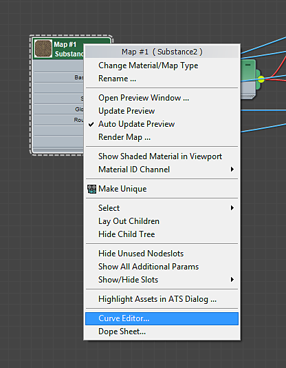
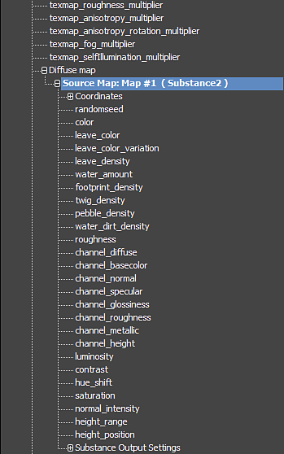

# Animating a Substance material

You can animate Substance textures using the Curve Editor in 3ds Max.

1. Right-click on the Substance2 node and choose "Curve Editor."'

   
1. Click the + sign on the corresponding material to reveal all of the channels. The Substance parameters can be found under the maps listed for the material. Changing a parameter will propagate to all of the Substance texture regardless of which texture map you choose when selecting the Substance parameter to animate.
1. Scroll down to where you see the Diffuse Map and click the + to reveal Source Map parameters. Here you will see all of the parameters from the Substance file.

   
1. Click on the parameter you want to animate and then click the ‘Add/Remove Key’ button on the toolbar. Click on the line in the Curve Editor to place keyframes.

   
