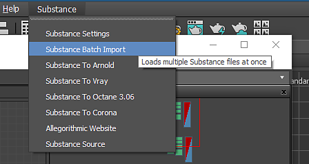

# Batch Import

You can batch import multiple .sbsar Substance files using the Batch Import.

1. Go to the Substance Settings at the top of the 3ds Max UI and choose Substance Batch Import.
1. Choose the .sbsar files you want to import.

   
