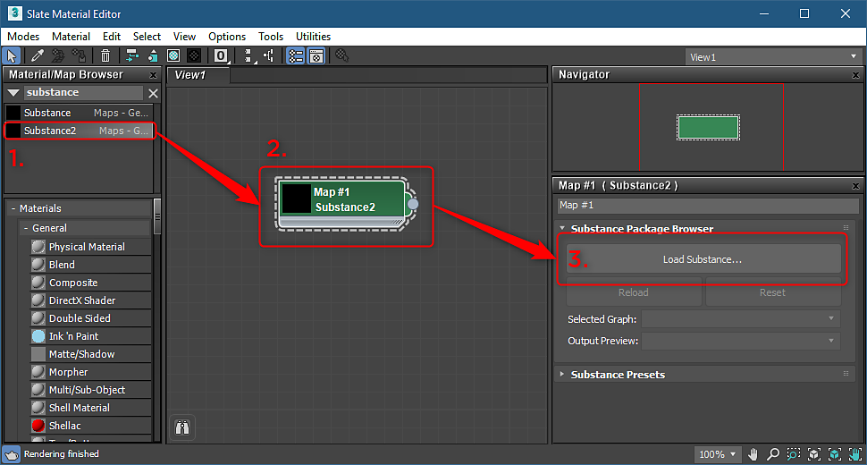
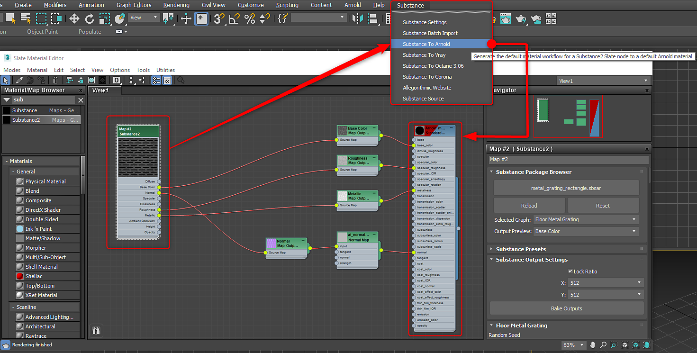
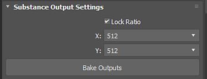
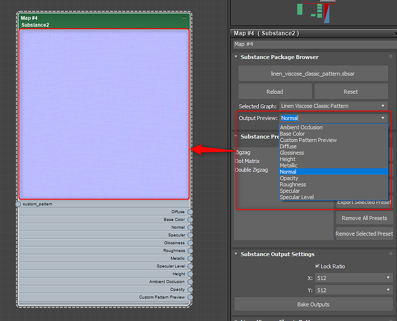
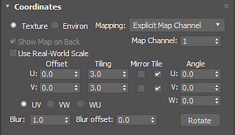

# Substance in 3ds Max Overview

## Plugin Overview:

## Opening a Substance

1. Open the Slate editor, search for Substance and drag the Substance2 node to the view.
1. Double click the Substance node to activate the properties and under Substance Package Browser, load a Substance.

   >[!NOTE]
   >
   > You can also drag and drop the .sbsar file into the Slate Editor to automatically create the node and import the sbar.
1. If a Substance contains multiple graphs, you can choose the graph you want to output as a material in the Selected Graph drop down menu.

   

   
1. With the Substance node selected, go to the Substance menu and choose a supported renderer. The material will be created and ready to be applied to the object. Substance textures are hooked into the rendering material.

   | Supported Renderers |
   | --- |
   | Arnold |
   | Vray |
   | Corona |
   | Octane |

   

## Changing Resolution:

1. Set the desired resolution for the computed Substance textures in the Substance Output Settings.
1. For resolution up to 8K, make sure you are using the GPU engine, which is set in the [Substance Settings](../substance-settings/substance-settings.md).

   

## Changing Parameters:

1. Double click on the Substance node to load the Substance parameters in the parameter window.
1. Change the parameters to update the Substance textures automatically.

   {width="500px"}

## Setting Output Preview:

You can set a specific channel for the thumbnail for the Substance node.

1. In the Output Preview drop down, choose the channel you want to use for the node thumbnail.

   

## Tiling Substances:

You can use the Coordinates properties to tile Substance textures and set Map Channels.

