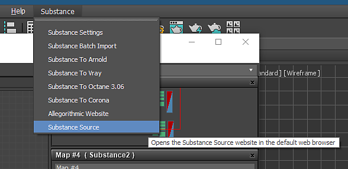

# Substance Source

You can use Substance materials from Substance Source in 3ds Max v2 plugin.

1. In the Substance menu at the top of the 3ds max UI, choose Substance Source.
1. A browser will open and you can login to your Source subscription to download .sbsar files.
1. Import the .sbsar file into 3ds Max using the Substance Plugin.

   
