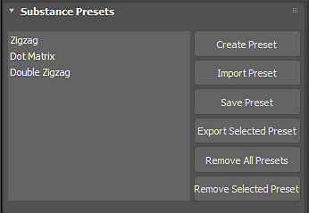

# Using Presets

Substance files can contain embedded preset files. If a Substance has an embedded preset file, it will appear in the Substance Presets window. You can also create your own presets based on the settings you choose for the Substance Parameters.

1. Create Preset will create a new preset based on the parameter settings you have a set for the Substance in 3ds Max.
1. Import Preset will import a preset file (.sbsprs).
1. Save Preset will save the parameter values for the currently selected preset.
1. Export Selected Preset will export the preset to preset file (.sbsprs).
1. Remove all Presets will remove the presets in the preset list.
1. Remove Selected Preset will remove only the selected preset.
