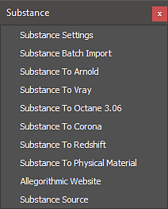
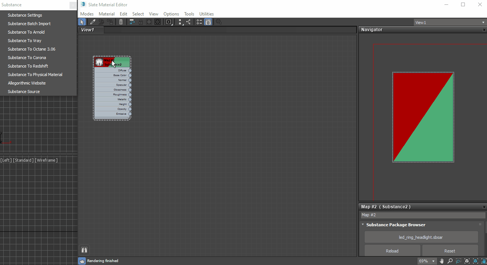

# Using Workflows in 3ds Max

The Substance in 3ds Max plugin contains workflows for automatically creating a shader network to support renderers. The render workflows can be found in the Substance menu.

To use a workflow, select the Substance node in the material editor and then choose the workflow from the Substance menu.

