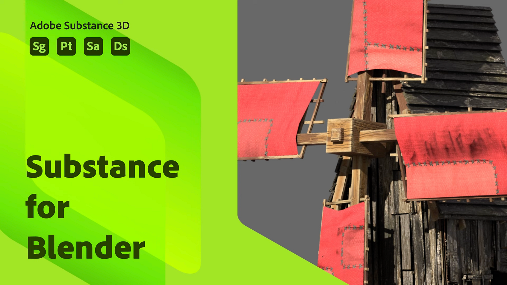

# Blender

## Table of Contents

* [Substance in Blender Overview](substance-blender-ove/substance-in-blender-overview.md)
* [Downloading and Installing the Plugin](downloading-and-ins/downloading-and-installing-the-plugin.md)
* [Preferences](preferences/preferences.md)
* [The Substance 3D Panel](the-substance-3d-panel/the-substance-3d-panel.md)
* [Shortcuts and Navigation](shortcuts-and-navigation/shortcuts-and-navigation.md)
* [Workflows](workflows/workflows.md)
* [Physical size in Blender](physical-size-in-blender/physical-size-in-blender.md)
* [Substance 3D Assets Library](substance-assets-librar-2/substance-3d-assets-library.md)
* [Troubleshooting](troubleshooting/troubleshooting.md)
* [Uninstalling the Add-on](uninstalling-the-add-on/uninstalling-the-add-on.md)
* [Substance 3D Add-on for Blender Tutorials](substance-add-for-blender/substance-3d-add-on-for-blender-tutorials.md)
