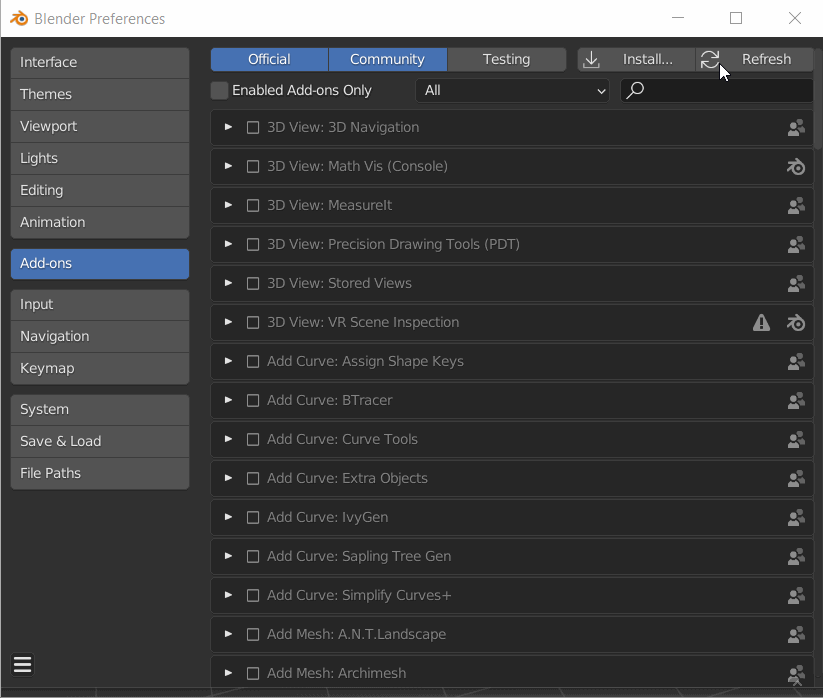

# Downloading and Installing the Plugin

## Download

The addon can be downloaded from the [Substance 3D in Blender](https://substance3d.adobe.com/plugins/substance-in-blender/). Click <b>Adobe Substance 3D add-on for Blender</b> to signing in with an Adobe account and access the download page. Navigate to the bottom of the page to download the .zip files for the Substance 3D add-on and Substance 3D Integration Tools.

There are two separate .zip files to download and install:

* Substance 3D add-on for Blender (single download for all platforms)
* Substance 3D Integration Tools (download Windows, Mac, or Linux version)

>[!WARNING]
>
> <b>For Mac users:</b> *Users should disable "open safe files after downloading" if they are downloading the add-on with Safari.*
> 
> Safari web browser defaults to unzipping downloaded .zip files, which need to remain zipped when for installation. To prevent the file from unzipping, update Safari preferences to not open "safe" files after downloading.
> 
> 1. Open Safari
> 1. Click Preferences
> 1. Under the General tab, uncheck the option Open “safe” files after downloading

## Install Steps

### First time installation

1. Download the add-on .zip files from the Adobe prerelease page.
1. Open Blender (v. 3.0 or higher).
1. From the top navigation bar, select Edit and then Preferences. Then select the Add-ons tab.
1. Click the **Install** button.
1. In the file explorer, locate the folder to where the .zip files were downloaded to
1. Select the Substance3DInBlender.zip file and click the **Install Add-on** button.
1. In the Add-ons section, click the checkbox to enable the add-on and click the drop-down arrow the expand the section.
1. You will be prompted to install the Integration Tools. Click **Install from disk** to select the Substance3DIntegrationTools.zip and click the **Install tools** button.   
   If they were not previously downloaded, click **Download** to open the Adobe prerelease page in your browser and download the tools, then use **Install from disk** to install them.
1. The addon is now ready to use!

### Updating Add-on and Tools

1. Download the newest release from the Adobe prerelease page.
1. Use the **Uninstall Tools** button to remove the Substance3D Integration Tools.
1. Use the **Remove** button to uninstall the add-on
1. Close and restart Blender
1. From the top navigation bar, select Edit and then Preferences. Then select the Add-ons tab.
1. Click the **Install** button.
1. In the file explorer, locate the folder to where the .zip files were downloaded to
1. Select the Substance3DInBlender.zip file and click the **Install** Add-on button.
1. In the Add-ons section, click the checkbox to enable the add-on and click the drop-down arrow the expand the section.
1. You will be prompted to install the Integration Tools. Click **Install from disk** to select the Substance3DIntegrationTools.zip and click the **Install tools** button.   
    If they were not previously downloaded, click **Download** to open the Adobe prerelease page in your browser and download the tools, then use **Install from disk** to install them.
1. The addon is now ready to use!

### Updating Individual Components

When updating the Add-on only:

1. From the add-on preferences, use the **Remove** button to uninstall the add-on.
1. Restart Blender
1. Navigate to the add-on preferences again and use the **Install** button to load the new version of the add-on. The previously loaded Integration Tools will remain.

When updating the Integration Tools only:

1. From the add-on preferences, use the **Update Tools** button to load the newer version of the Integration Tools. The previously used Add-on will remain.
1. Restart Blender for changes to take effect.

OR

1. From the add-on preferences use the **Uninstall Tools** button to remove the Integration Tools.
1. Restart Blender
1. Use the **Install from disk** button to find and load the newer version of the Integration Tools. The previously used Add-on will remain.
