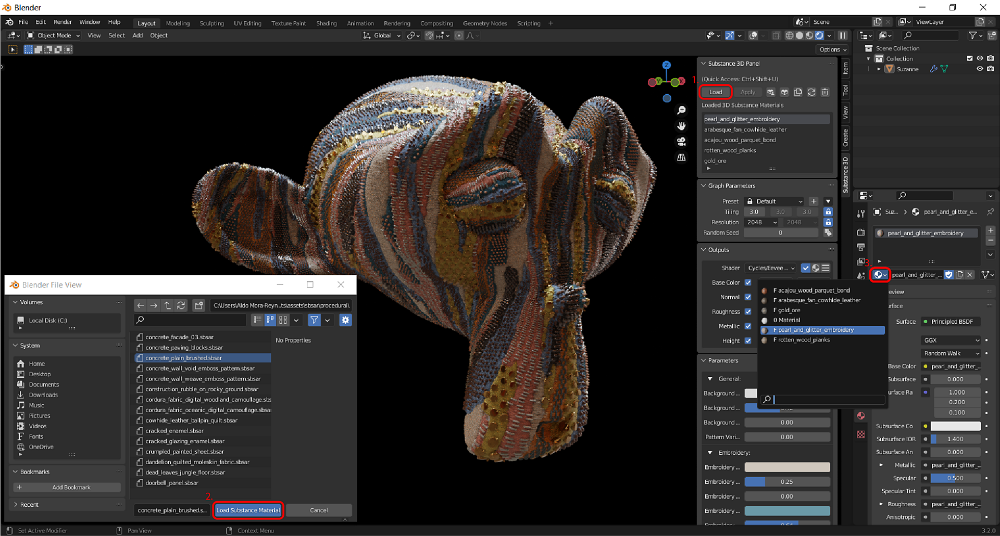
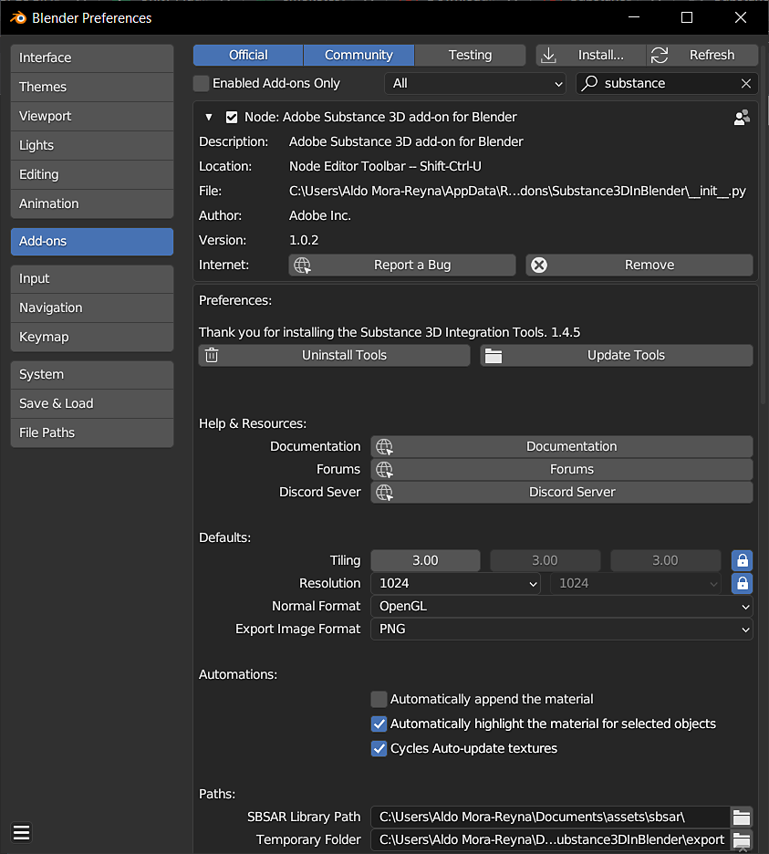
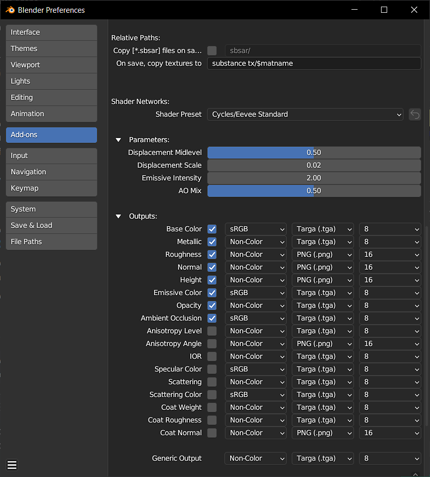
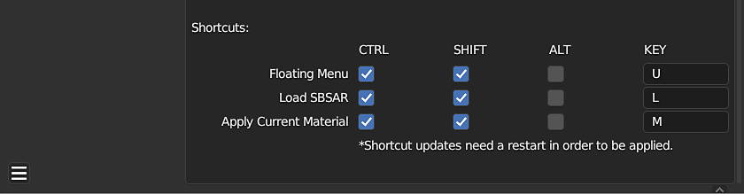

# Substance in Blender Overview

## Plugin Overview

The Substance 3D add-on allows you to import Substance materials into Blender. Using the Substance 3D Panel, you can manage and the customize the Substance materials in your project from one location. The add-on generates texture maps from .sbsar files and uses them to create a blender material. These textures are updated automatically when Substance parameters are adjusted.

## Importing a Substance Material

1. Click on the **Load** button in the Substance 3D Panel.
1. In the window that opens, navigate to the location where your .sbsar files are stored and select one or more. Then click the **Load Substance Material** button.
1. Click on the sphere icon in the material panel to open the drop down and select your Substance material. This will assign the material to the current slot. Alternatively, use the Apply button in the Substance 3D Panel to assign the material in a new material slot that wont override the current assignment.

>[!NOTE]
>
> If the object has no materials, the **Apply** button will automatically attach the Substance material.

## The Substance 3D Panel

The Substance 3D Panel is used to manage the Substance materials in a project, and adjust their individual parameters. The Graph Parameters section has controls for texture resolution, tiling, randomization, and presets. The outputs section has controls for the image formats of generated textures. The Substance Parameter section is where is where Substance parameters can be adjusted.  
  
For more information, see the [Substance 3D Panel](../../../3d-applications/blender/the-3d-panel/the-substance-3d-panel.md) page.

## Preferences

Default behaviors and other settings can be adjusted in the add-on preferences. "Automatically attach the material" can be enabled to automatically attach Substance materials to objects and override the current material assignment. "Automatically highlight the material for selected objects" will change the highlighted material in the Substance 3D Panel if an object with that material is selected. Enabling "Cycles Auto-update textures" will allow textures to be updated in the 3D Viewport while using Cycles render view.   
  
Displacement can be enabled with the toggle for Height in the Outputs section. Here you can also adjust the file format and bit depth of each output.  
  
For more information, see the [Preferences](../../../3d-applications/blender/preferences/preferences.md) page.

<table>
<tr style="border: 0;">
<td style="border: 0;" valign="top">

</td>
<td style="border: 0;" valign="top">

</td>
<td style="border: 0;" valign="top">

</td>
</tr>
</table>

## Find More Substance Materials

Thousands of professionally created materials and other assets are available for download on the [Substance 3D Assets page](https://helpx.adobe.com/substance-3d/unlisted/assets.html). Many more assets that have been shared by the Community for free can be found on the [Substance 3D Community Assets page](https://helpx.adobe.com/substance-3d/unlisted/community-assets.html)

## Community

For general help, feedback, or to report defects, please join the #substance-blender-beta channel on the [Substance Discord server](https://discord.com/invite/substance3d) or [Adobe communities](https://community.adobe.com/t5/substance-3d-plugins/ct-p/ct-substance-3d-plugins?page=1&amp;sort=latest_replies&amp;lang=all&amp;tabid=all&amp;topics=label-blender).
