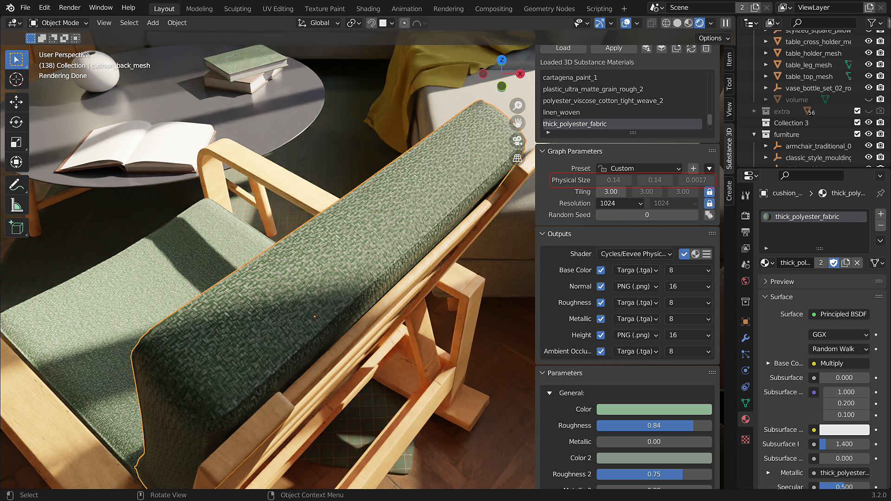
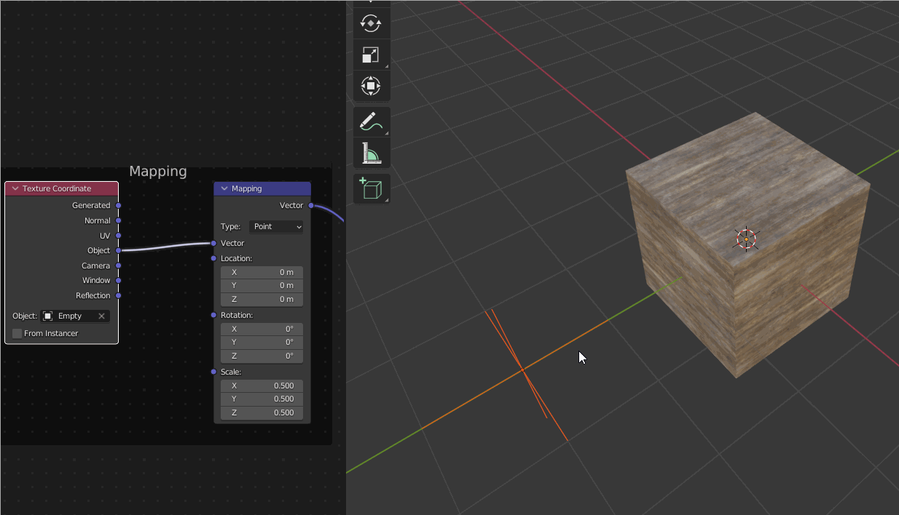

# Physical size in Blender

Physical Size in Substance materials allows materials to be scaled based on their size in the world. The dimensions are set in Substance applications like Designer and shown in the plugin panel's Physical Size section.

With Physical Size enabled, the materials will tile based on their real-world size in centimeters. The material tiling will remain the same regardless of the objects' scale. The feature can be enabled by switching to the Physical Size shader in the add-on panel. After adjusting the scale of an object, the scale should be applied with ctrl/cmd+A to accurately tile the Physical Size Texture.

## Adjusting Physical Size

The values in the mapping node can be adjusted for artistic control over Physical Size tiling. Additionally, an object such as an Empty be used for the Texture Coordinate input to control the texture mapping using the input object's transformations (see example below).

