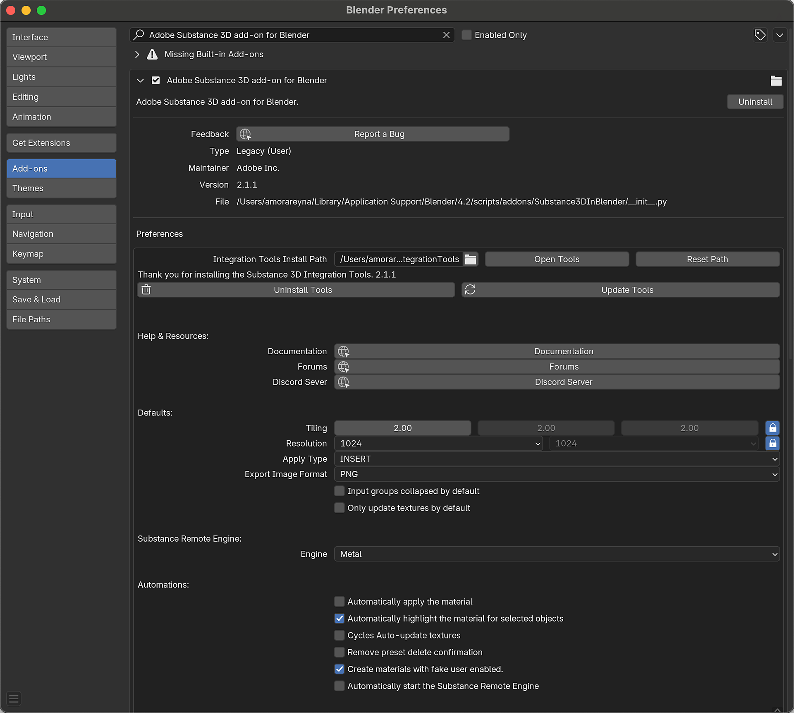
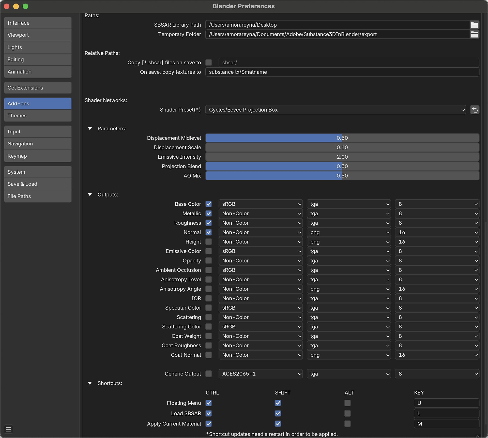

# Preferences

The add-on preferences can be found within Blender's preferences window. Navigate to Edit &gt; Preferences &gt; Add-ons, and search for Node: Adobe Substance 3D add-on for Blender.

<table>
<tr style="border: 0;">
<td style="border: 0;" valign="top">

</td>
<td style="border: 0;" valign="top">

</td>
</tr>
</table>

<b>Uninstall</b> - Deletes the add-on from the system and removes it from the add-on list in Blender.

<b>Report a Bug</b> - Opens the Substance 3D for Blender Discord.

<b>Accept Tools Folder</b> - Opens the Blender file browser to choose the Substance Integration Tools install path.

<b>Open Tools </b>- Open the system file browser at the Integration Tools folder location.

<b>Reset Path</b> - Resets the Integration Tools folder path to the default location.

<b>Uninstall Tools</b> - Removes the installed version of the Substance 3D Integration Tools.

<b>Update Tools</b> - Opens file browser to select the tools zip file and update the tools.

<b>Documentation</b> - Opens the Ecosystem and Plugins documentation page in the browser.

<b>Forums</b> - Opens the Adobe Community Forums in the browser.

<b>Discord Server</b> - Opens the Ecosystem and Plugins Discord server in the browser.

<b>Tiling</b> - Adjust the X, Y, and Z tiling of the material. The lock can be used to unlink the values and adjust them individually.

<b>Resolution</b> - The default resolution for generated textures. The lock can be used to unlinked to set their resolutions independently.

<b>Apply Type </b>- Sets the behavior of the Apply button: <b>Insert </b>will override the current material with the selected Substance material, and <b>Append</b> will add the material to the object in a new material slot.

<b>Export Image Format</b> - When images generated within Blender are used as image inputs for a Substance material, this format is used to save that image to the temporal folder.

<b>Input groups collapsed by default</b> -  Toggles weather the Substance material's input groups are expanded or collapsed by default.

<b>Only update textures by default</b> - Toggles weather updating Substance parameters only affects the output textures in the Blender Shading network. Disabling this will reset node connections after adjusting parameters. Enabling is recommended when adding additional nodes to a material, otherwise those will be disconnected after adjusting parameters.

<b>Substance Remote Engine </b>- Sets the hardware used by the Substance Remote Engine.

<b>Automatically apply the material</b> - When a Substance material is created, automatically attach the material to the selected object(s) in a new material slot.

<b>Automatically highlight the material for selected objects</b> - Change the highlighted material in the Substance 3D Panel if an object with that material is selected.

<b>Cycles Auto-update textures</b> - Forces texture to updating in the 3D Viewport while using Cycles render view.

<b>Remove preset delete confirmation</b> - Removes the confirmation window that appears when deleting material presets.

<b>Create material with fake user enabled</b> - Sets weather the material is created with "fake user" enabled or disabled. Blender data marked as fake user is not purged after closing even when the data is not used.

<b>Automatically start the Substance Remote Engine </b>- Toggles if the Substance Remote Engine is initialized when Blender starts up. If disabled, the remote engine will only start when a user load button or uses the load shortcut.

>[!NOTE]
>
> NOTE: If using Substance Connector, the SRE must be active for the sending application to detect Blender as an endpoint.

<b>SBSAR Library Path</b> - The folder that is opened by default when the Load button to search for a substance file.

<b>Temporary Folder </b>- This folder will be the default location where textures are stored before a file is saved for the first time.

<b>Copy .sbsar files on save to</b> - When enabled, .sbsar files are copied to the specified relative path when the file is saved. This can facilitate sharing projects between devices.

<b>On save, copy textures to</b> - When a file is saved for the first time, textures in the temporary folder will be copied to this location. The $matname variable is used to create subfolders for each material.

<b>Shader Preset</b> - Sets the default shader preset that is used when creating Blender materials from substances files. Can be set to standard for UV based mapping or projection for box, sphere, and cylinder projection-based mapping.

<b>Displacement Midlevel</b> - The default value is the base for displacement in the Displacement Node. Values Higher than the default will push surfaces outwards and values lower than the default will pull surfaces inwards.

<b>Displacement Scale</b>- The default scale value in the Displacement node.

<b>Emissive Intensity</b> - The default value for Emission Strength in the Principled BSDF node.

<b>Projection Blend</b> - Sets the amount of blending between angles for the projection method shaders.

<b>AO Mix</b> - When Ambient Occlusion is enabled as an output, this value determines the default factor value of the MixRGB node that is used to combine the Base Color and Ambient Occlusion textures.

<b>Outputs</b> - The individual outputs of materials can be enabled or disabled. The default color space, file format, and color depth of individual outputs can be adjusted as well.

<b>Shortcuts </b>- Customize the shortcut keys used to bring up a floating menu, load a Substance material, and apply the current material. Shortcut updates require a restart to take effect.
