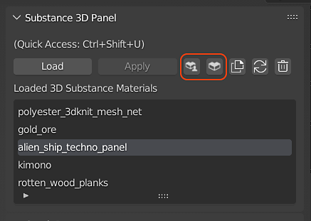

# Substance 3D Assets Library

Thousands of professionally created materials and other assets are available for download on the [Substance 3D Assets page](https://helpx.adobe.com/substance-3d/unlisted/assets.html). Many more assets that have been shared by the Community for free can be found on the [Substance 3D Community Assets page](https://helpx.adobe.com/substance-3d/unlisted/community-assets.html).

From the Substance 3D Panel within Blender, you can also click on the Substance 3D Assets and Substance 3D Community Assets buttons to open the web browser to those pages.

