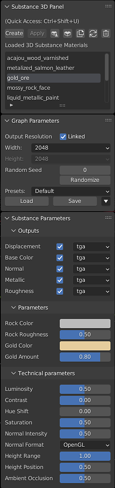

# The Substance 3D Panel

## Panel Controls

**Create** - Opens the file browser to Select a Substance 3D material. By default, this creates a blender material using textures generated from the .sbsar file.

**Apply** - Attach the selected Substance 3D material to the selected objects in a new material slot. This does not override previous material assignments on the object.

**Substance 3D Community Assets** - Opens the Substance 3D Community Assets page in the web browser.

**Substance 3D Assets** - Opens the Substance 3D Assets source page in the web browser.

**Duplicate Selected Substance 3D Material** - Load a new instance of the selected Substance 3D material. The parameters of different instances of the same Substance material can be adjusted independently of one another.

**Refresh** - Reloads the Substance 3D material

>[!WARNING]
>
> **Warning:**
> 
> Using the refresh button will undo any user changes to the shader graph. Copy any user-added nodes before refreshing to paste them into the graph after the refresh.

**Remove** - Removes the selected Substance 3D material from the panel.

>[!NOTE]
>
> The Blender material crated from the Substance material will remain in the project. It can deleted or removed from objects manually.

**Loaded 3D Substance Materials** - Displays a list of the Substance Materials that have been loaded into the .blend file.

## Graph Parameters

**Output resolution** - Dropdowns for the with and height resolution. These can be unlinked to adjusted the values independently.

**Randomize and Random Seed** - The randomize button generates a new random seed value to change parameters that can use random values. The random seed can also be set manually.

## Working with Presets

SBSAR files may be published with presets, which can be found in the Preset dropdown box. To make your own presets, adjust the parameters as desired and use the **Save** button. There are additional options to export the selected preset as a .sbsprs file, and for deleting the selected preset from the dropdown list. The **Load** button can be used to import presets from .sbsprs files.

## Substance Parameters

Parameters that have been exposed in Substance Designer can be adjusted using the Substance Parameter controls. These parameters are set by the creator of the Substances Material and will vary between materials. Adjusting these parameters will update the generated textures, as indicated by the processing icon next to the material name in the Loaded 3D Substance Materials section.

The file format of output textures can be toggled and changed via the dropdowns.

For more information, see the [Exposing a Parameter](https://helpx.adobe.com/substance-3d-designer/substance-compositing-graphs/manage-parameters/exposing-a-parameter.html) on the Designer documentation page.

## Technical Parameters

Substance Materials may have set of technical parameters. These are additional controls for color correction and other material adjustments.
