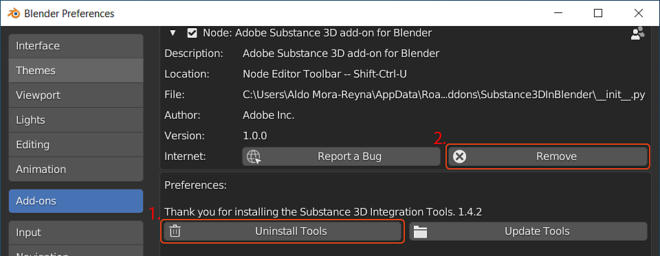

# Uninstalling the Add-on

To uninstall the add-on, navigate to Edit &gt; Preferences &gt; Add-ons and expand the section for the add-on.

1. First remove the integration tools with the **Uninstall Tools** button.
1. Then remove the add-on files with the **Remove** button

>[!NOTE]
>
> If the Substance Integration Tools need to be removed manually, delete the Substance3DIntegrationTools folder from the following directory
> 
> * **Windows**: C:\Users\(username)\AppData\Roaming\Adobe
> * **Mac**: /Users/(username)/Library/Application Support/Adobe/Substance3DIntegrationTools
> * **Linux**: /home/(username)/Adobe/Substance3DIntegrationTools

