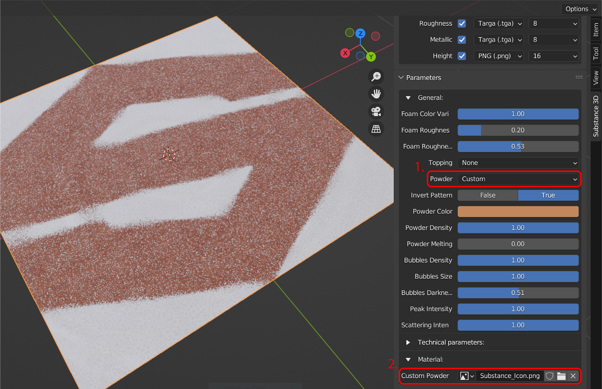
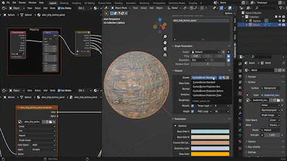

# Workflows

## Working with Cycles

By default, parameter changes do not automatically update in the 3D viewport when viewed in Cycles render view. To see updates in Cycles render view, enable **Cycles Auto-update textures** in Preferences to force updating.

## Multigraph .sbsar Files

The add-on supports .sbrar files with multiple substance graphs. When loading a file with multiple graphs, a new Graphs dropdown will appear on the Substance 3D Panel. Unlike with other parameter changes, switching graphs will not automatically update the material. Because of this, the **Apply** button must be used to assign the material again after changing graphs.

>[!NOTE]
>
> By default, the Apply button adds the material in a new slot without overriding previous material assignments. Remove previous materials, or use the material dropdown to reassign newly applied materials.

## Working with Image Inputs

When using a Substance material that allows custom image inputs, an image selection parameter Substance 3D Panel will allow you to open the file browser for an image (folder icon) or select from an image that exists in your project (image icon drop down).  
  
The Export Image Format preference can be used to to save image inputs generated within Blender to the temporary folder. See the [ Preferences ](../preferences/preferences.md)page for more details.

## Shader Network Presets.

The shader preset can be quickly adjusted via the dropdown in the Outputs section of the Substance 3D Panel. These shader presets adjust the way that image textures are applied.Cycles/Eevee Standard uses regular UV texture coordinate mapping. The other three Cycles/Eevee Projection presets use generated texture coordinate mapping for box, sphere, or cylinder projection methods.

The default shader preset used by materials can be selected in the add-on [Preferences](../preferences/preferences.md).

## Filtering and Adjusting Outputs

The Outputs section of the Substance 3D Panel also has options for filtering outputs. Three buttons next to the shader preset dropdown can be used to filter by enabled outputs (checkmark), shader outputs (sphere), and all available outputs (lines).

Outputs can enabled individually using the checkbox. When an output is enabled, a corresponding output in the texture node group will be created. If that output is supported by the Principled BSDF material node, it will be automatically connected to it. Height will connect to a displacement node and Ambient Occlusion will combine with the base color in a MixRGB node.  
The file format dropdown next to the checkmark can be used to set the file type that the output texture is saved as.

Additionally, the default file output preferences can be changed in the add-on [Preferences](../preferences/preferences.md).

## Swapping Materials on Objects

Click on the sphere icon in Blender's material properties panel to open a list of materials in your Blende project. Substance materials that have been created in the panel will also appear in the list. Selecting a material from this list will replaces the active material in that material slot.

## Displacement

Displacement of the mesh from textures in supported in the Cycles renderer, but not in Eevee. To see displacement, make sure that the Height output is enabled. The add-on will automatically set the material's displacement setting to **Displacement and Bump**. Viewing the material on an object will now show displacement in the render view. The displacement scale can be adjusted in the material panel or on the displacement node.

For best results, use higher subdivision levels or high-poly meshes for materials with complex displacement details.
