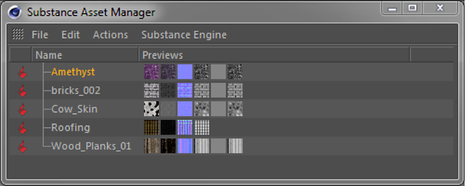
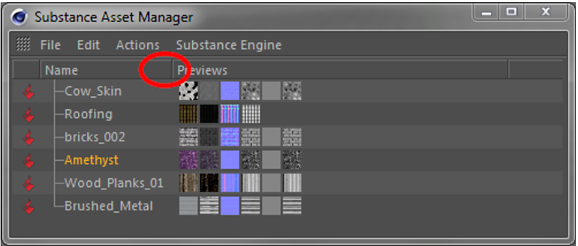
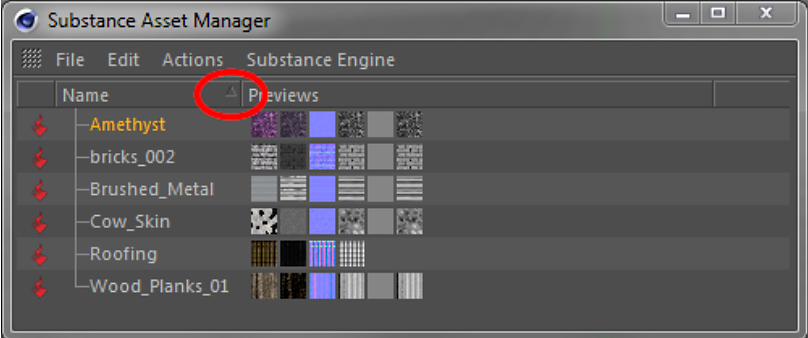

# Substance Asset Manager

The Substance Asset Manager window lists all Substances loaded in a scene. Here you can add, remove and reorganize Substances.

Selecting (left click) a Substance inside the Substance Asset Manager opens the Substance in Cinema 4D's Attribute Manager. There you can change the parameters and keyframe Substance inputs like any other parameter in Cinema 4D.

>[!NOTE]
>
> The Attribute Manager has a special Substance Asset mode, which comes in handy for having a dedicated Attribute Manager for Substances in your Cinema 4D layout.

{width="500px"}

## File menu

## Load asset...

Load a new Substance into the scene (same as in Plugins menu).

Close

Closes the Substance Asset Manager. Loaded Substances will of course stay in the scene.

## Edit menu

## Select All Substances

Selects all Substances listed in the Asset Manager. Same can be achieved by pressing Ctrl+a, while the mouse is hovering over the Asset Manager.

## Deselect All Substances

Deselects all Substances listed in the Asset Manager. Same can be achieved by pressing Shift+Ctrl+a, while the mouse is hovering over the Asset Manager.

## Select from Selected Material(s)

Selects all Substances that are referenced by the currently *selected* materials.

## Select from marked Material(s)

Selects all Substances that are referenced by the currently *marked* materials. In Cinema 4D, a material gets marked if an object or tag using this material is selected.

## Select Material(s)

Selects all materials, that reference the currently selected Substances.

## Actions menu

## Create Material(s)

Create new Cinema 4D materials from the currently selected Substances. The material channels will automatically be initialized with Substance shaders referring to the respective output channels of the Substances.

## Duplicate Substance(s)

Duplicate the currently selected Substances. This can be useful to use the same Substance with different parameter sets on multiple materials.

## Re-import Substance(s)

This function can be used to return to the default values of a Substance or to integrate external changes (e.g., from the Substance Designer).  
 Note: **All** parameter changes on the Substance inputs will be lost!

## Remove Substance(s)

Removes currently selected Substances from the scene. The same can be achieved by pressing the Delete key while the mouse is hovering over the Asset Manager.

## Delete Unused Substance(s)

Removes all Substances currently not referenced by any material.

## Substance Engine menu

The content of this menu depends on the operating system on which Cinema 4D is running. Changing the Substance Engine will only take effect after a restart of Cinema 4D.

## Context menu

By right-clicking a selected Substance, the context menu will show up. Their functionality is the same as identically named functions in the aforementioned menus:

* Remove
* Create Material(s)
* Duplicate Substance
* Re-import Substance
* Select All Substances
* Deselect All Substances
* Select Material(s)

## Drag &amp; Drop

You can interact with the Substance Asset Manager via drag and drop. There are several available options:

* Load Substance(s) into the scene via drag and drop from Explorer or Finder by simply dropping them onto the Substance Asset Manager.
* Substances can be dragged into the link field of Substance shaders in order to connect a shader and a Substance asset.
* If in Unsorted mode (see below), you can re-arrange Substances in the Asset Manager by dragging them to a new location.

## Sorting in Substance Asset Manager

## Unsorted Mode

## The Substance Asset Manager is in **Unsorted mode by default**. The header cell of the name column does not display an arrow on the right. You can use drag and drop to re-arrange the substances to your liking.

{width="500px"}

{width="500px"}

## Previews in Substance Asset Manager

## Substance Asset Manager displays small icons with previews of the available channels for each Substance.

## The previews are simply displayed in the order of output channels in the Substance. There is no meaning to the column in which a preview is displayed.
