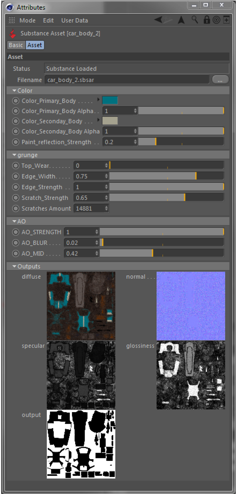
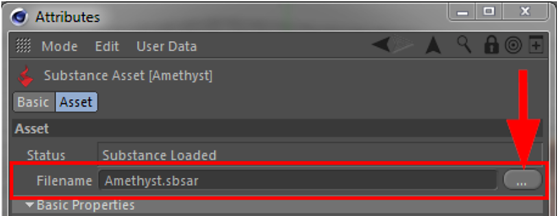
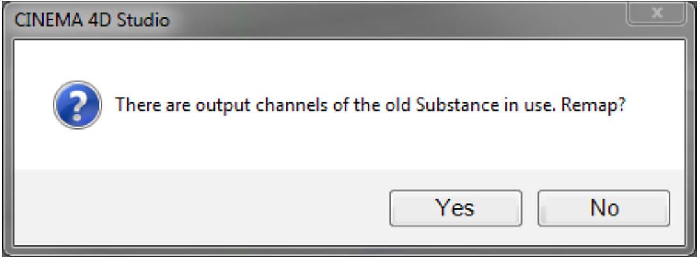

# Attribute Manager

There is a new mode for the Substance assets in Cinema 4D's Attribute Manager.

When a Substance is selected in the Substance Asset Manager, the Attribute Manager will automatically switch to the Substance asset mode. You can also switch manually to this mode in the attribute Manager's mode menu.

In Substance asset mode you have access to all inputs of a Substance, and you also have an overview of all output channels.

{width="500px"}

## Grouping of Substance Inputs

If inputs of a Substance are grouped, these groups will be shown as such in the Attribute Manager. There are two pre-defined groups: **Basic Properties** and **Image Inputs**.

* In the Basic Properties group, all inputs that were not assigned to a group in Substance Designer will be shown.
* As the name already suggests, all Substance Inputs linking to external images are collected in the Image Inputs group.

## Filename parameter

By using the Filename parameter in the Attribute Manager, the file location of Substance assets can be changed after they were loaded into a scene.

{width="500px"}

This can be useful not only for relocating Substance files, but also when exchanging a Substance with a completely different one.

In this case the user will be asked, if any existing references to previous Substance output channels should be remapped to the new Substance.

{width="500px"}

If the question is answered with 'No', links to the previous Substance will be deleted from all Substance shaders. In order to re-map the output channels, the plugin will first search for output channels with the same type and then with the same name.

## Parameter Tri-state

If multiple Substances are selected at the same time, inputs shared between these Substances will be shown as tri-state and can be edited for all selected Substances simultaneously (just like all other parameters in Cinema 4D).

In these instances, the output channels will be displayed as shown below.

{width="300px"}
