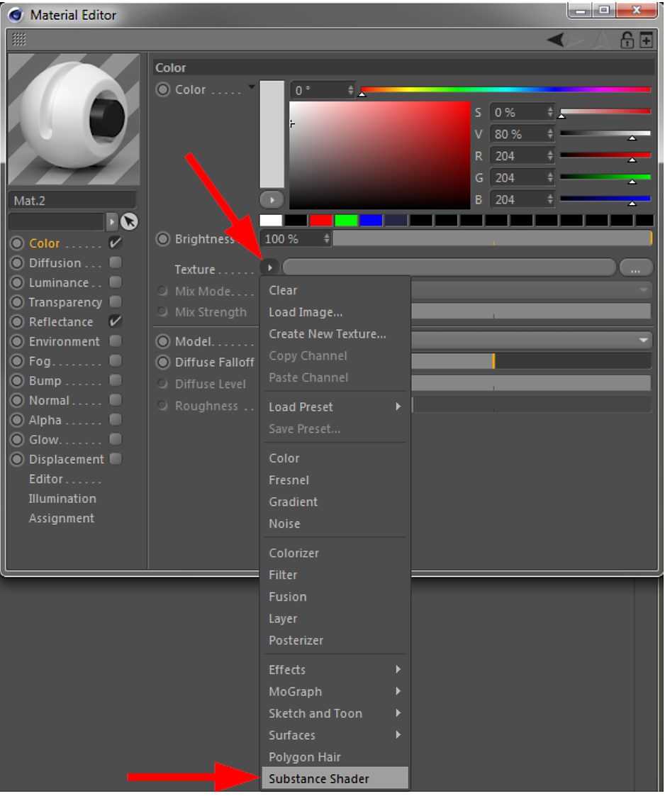
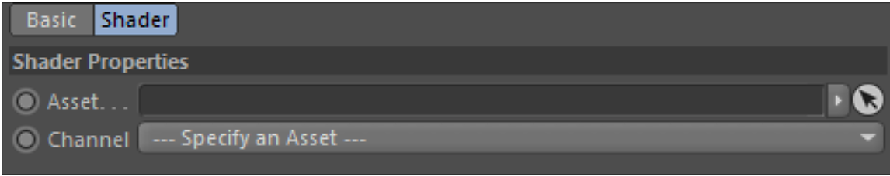

# Substance Shader

A Substance shader is the link between a Substance asset and a Cinema 4D material.

The Substance shader can be found in the normal Cinema 4D Material Editor selection menu, as shown in the screenshot below:

{width="500px"}

After manually adding a Substance shader, it has no linked Substance asset. It will look like below and when rendered, the material will look like the image on the right:

{width="500px"}

To access the parameters of the Substance shader, you can either click the small arrow on the top left, or on the shader's preview image.

{width="500px"}

## Parameters

The Substance shader has two parameters:

* **Asset:** Here you can drop a Substance Asset from the Substance Asset Manager in order to link it to the shader. In other words, it will link a Substance asset to a Cinema 4D material channel.
* **Channel:** Select the output channel of the linked Substance.
