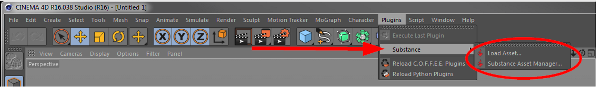
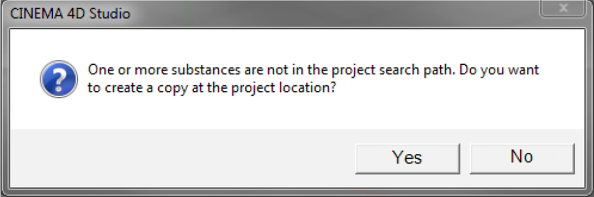

# Using the Substance Plugin

The Substance plugin is located in the Cinema 4D Plugins menu.

{width="500px"}

## Load Asset...

Use this to load Substance assets into your scene. Only Substance archives (.sbsar) can be loaded. If the Substance Asset Manager is not already shown, it will automatically be opened upon successful import of the Substance. This command can also be found in the Substance Asset Manager.

Upon import you may be asked if the Substance should be copied into your project folder.

{width="500px"}

* If you answer 'No', an absolute path to the Substance will be stored in your scene.
* If you answer 'Yes', the Substance will be copied into your project's tex sub-folder and in your scene it will be referred to by filename, only.

This prompt appears only once per import (e.g., when dragging and dropping multiple Substances from the Explorer or Finder).

## Substance Asset Manager

## Opens the Substance Asset Manager.

>[!NOTE]
>
> Just like with all other commands in Cinema 4D, these two commands can be integrated anywhere in your layout and/or configured with a keyboard shortcut for quick access.
