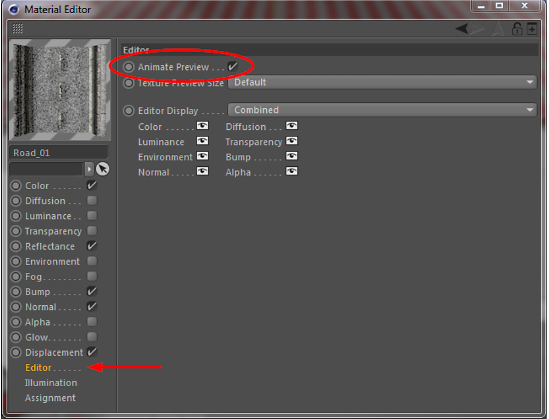
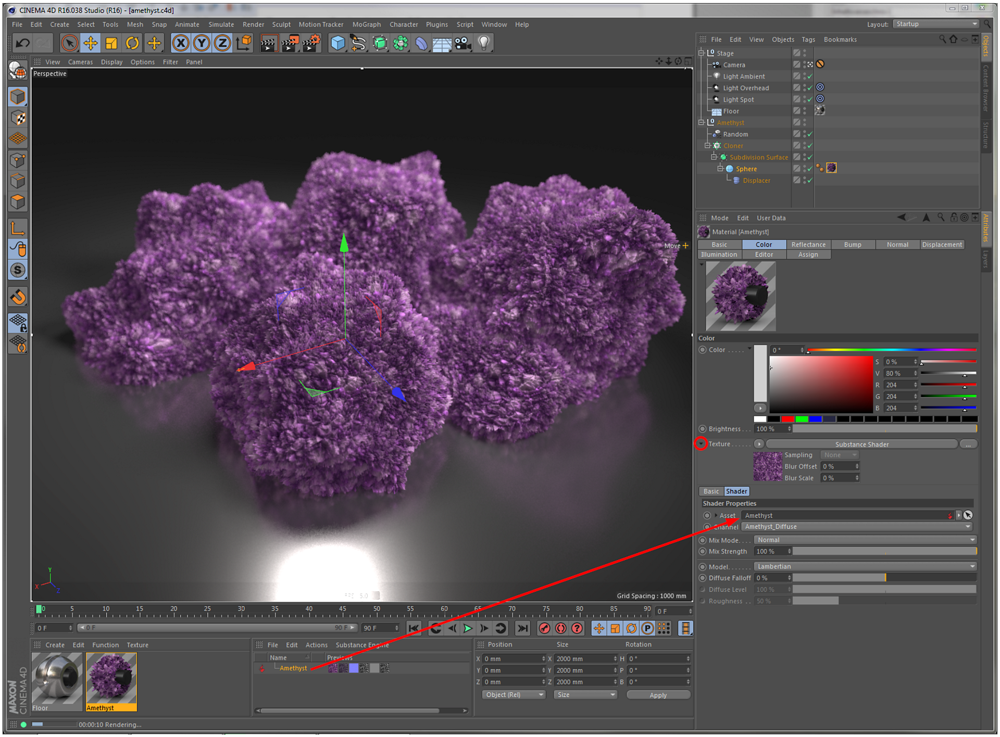

# Visual Feedback of Animated Substances

In order to have visual feedback of an animated Substance in Cinema 4D's viewport, the Animated Preview option should be enabled for these materials.

This option is found in the Material Editor under Editor (see below). If a material was created using the Create Material(s) command, this option will be enabled by default.

{width="500px"}

## Creating material(s)

Using the Create Material(s) command in the Substance Asset Manager you can easily and quickly create Cinema 4D materials using a Substance.

Therefore, the following channel mapping will be used:

|  |  |
| --- | --- |
| **Substance Output Channel** | **Cinema 4D Material Channel** |
| Diffuse | Color |
| Emissive | Luminance |
| Reflection | Reflectance |
| Environment | Environment |
| Bump | Bump |
| Opacity | Alpha |
| Specular | Reflectance / Default Specular |
| Height | Displacement |
| Normal | Normal |

This relation is only used for the Create Material(s) command and the material that was created can be subsequently modified. You may want to use this command to quickly create a base material, which can then be fine-tuned by tweaking only a few channels.

Inside the Substance Shader you are not limited to the few output channels listed above but in fact you can use any output channel a Substance may provide.

## Manually creating Substance material(s)

Instead of using the Create Material(s) command, you can also create materials manually using the Substance shader.

Simply select the Substance shader in a material channel and drag in the Substance you want to use. The next step is to select the output channel of the Substance to be used in this shader, and you're done.

Like so:

{width="800px"}

This method offers a lot of creative freedom and lets you do the following:

* Assign Substance output channels to arbitrary Cinema 4D material channels. There's no need to restrict yourself to only using them in the intended channels.
* Assign a single Substance output channel to several Cinema 4D material channels.
* Assign output channels of multiple Substances to a single Cinema 4D material.

## Limitations

* Keyframes on Substance input parameters are shown in the timeline, but not in Cinema 4D's Powerslider (the Timeline slider below the viewports).
* Due to a limitation, no custom color profiles should be used on Substance output channels.
* Under certain circumstances, image inputs of Substances will break on  
   Cinema 4D's Merge... command, which combines two scenes into one. This happens if the scene to be merged has Substances located in its project directory with image inputs referring to images in the project directory. In such cases, the image inputs will have to be relinked manually afterwards.
* If Substances are located in the project folder (or somewhere else in the global search path), they do not work in Cineware. In this case they are rendered red, as if the Substance is missing. In order to work around this issue, the Substance archives need to be stored outside the project directory, so they are referenced by an absolute path. You can use the Filename parameter to change the file location, after the files were moved outside of the project path.
