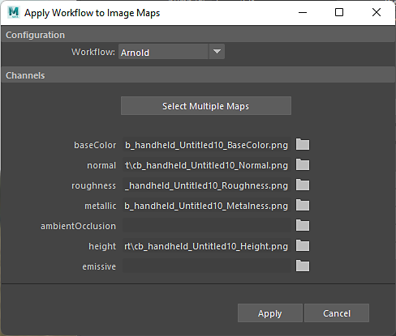

# Apply Workflow To Maps

You can use **Apply Workflow To Maps** to quickly apply exported textures from Substance 3D Painter or any painting application to a material in Maya.

The **Workflow** option allows you to choose which Renderer you are working with such as Arnold.

Use **Select Multiple Maps** to select several maps to be applied based on the naming convention listed on the left. *For example, \_roughness will map to the roughness channel.*

Individual maps can be added by clicking the folder button and selecting the texture.
