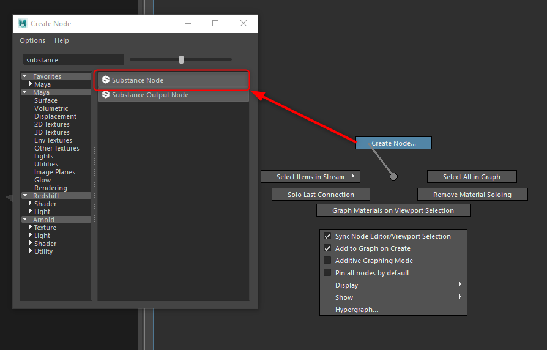
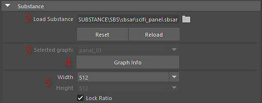
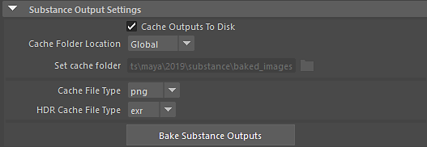
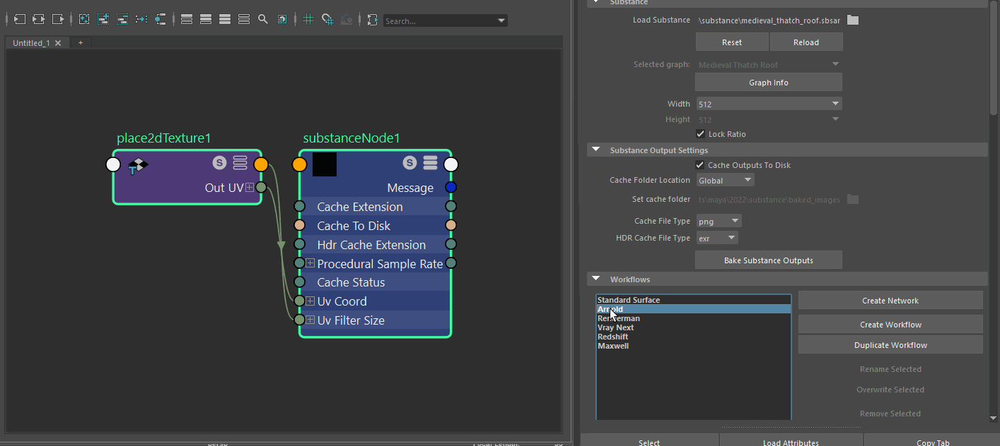

# Substance in Maya Overview

## Plugin Overview

The Substance plugin allows you to load a Substance material created in Substance Designer directly in Maya. The plugin will create a Maya material and feed the substance textures into the material channels inputs. You can then make changes to the substance parameters and the textures will automatically update.

>[!NOTE]
>
> Make sure you have the plugin loaded in the Settings/Preferences -&gt;Maya Plug-in Manager

## Opening a Substance

1. Open the Hypershade and in the Node Editor, right-click and swipe up in the marking menu to choose create node. This opens the Create Node window. From there, you can search for the Substance node.   
     
     
     
   You can also hit tab in the node editor and in the text field, type substance and this will filter to the substance options. From the options, choose Substance Texture.
1. Select the Substance node and in the Property Editor and browse to load a Substance (.sbsar) file.

   
1. The Selected Graph drop-down will populate if the Substance contains multiple graphs. The graph chosen will be used to create the material.
1. The Graph Info button will display the graph attributes set in Substance Designer.
1. Set the Resolution by choosing a value from the Width and Height drop-down box. Lock Ration is enabled by default.
1. Enable Cache Outputs to Disk in order to bake the Substance Outputs to disk so they can be used with renderers such as Arnold. The cached file will be read back in by the plugin using a Maya file node.

   
1. Choose a workflow for the renderer you are using and click the Create Shader Network button. A shader network is created for the renderer workflow. You can now apply the material in the scene.

   {width="1000px"}
