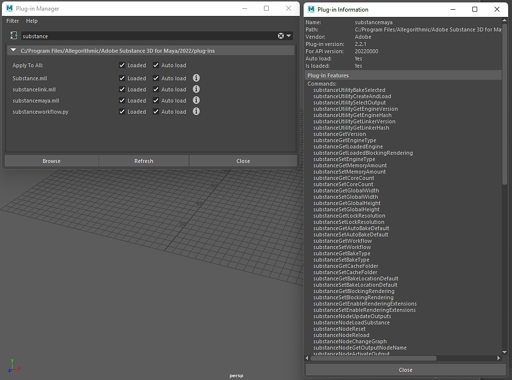

# Maya Scripting

The Substance in Maya plugin can be scripted. An exposed API allows Substance commands to be used in scripts for creating and managing Substance materials. You can access the available commands by going to the plugin information.

***Windows&gt;Settings/Preferences/Plugin Manager and search for the substancemaya.mll file.***

Click the "i" button to see the available commands



## Example Script:

This script will load an sbsar file and apply the Arnold render workflow to the selected mesh. To use the script, please follow the example listed here.

1. copy and paste the code into a Python tab of the script editor.
1. Select and mesh in the viewport
1. Select the text in the Python tab and hit "ctrl + enter"
1. In the window, browse for an sbsar file.

```

import maya.cmds as cmds 

 

def _connect_place2d(substance_node): 

    """ Connects the place2d texture node to the Substance node """ 

    place_node = cmds.shadingNode('place2dTexture', asUtility=True) 

 

    connect_attrs = [('outUV', 'uvCoord'), ('outUvFilterSize', 'uvFilterSize')] 

 

    for out_attr, in_attr in connect_attrs: 

        cmds.connectAttr('{}.{}'.format(place_node, out_attr), 

                         '{}.{}'.format(substance_node, in_attr)) 

 

def _find_shading_group(node): 

    """ Walks the shader graph to find the shading group """ 

    result = None 

 

    connections = cmds.listConnections(node, source=False) 

 

    if connections: 

        for connection in connections: 

            if cmds.nodeType(connection) == 'shadingEngine': 

                result = connection 

            else: 

                result = _find_shading_group(connection) 

                if result is not None: 

                    break 

 

    return result 

 

def _apply_substance_workflow_to_selected(substance_file, workflow): 

    """ Imports a mesh into Maya and applies the shader from a 

        Substance workflow to it """ 

    geometry = cmds.ls(geometry=True) 

 

## Create the substance node and connect the place2d texture node

    substance_node = cmds.shadingNode('substanceNode', asTexture=True) 

    _connect_place2d(substance_node) 

 

## Load the Substance file

    cmds.substanceNodeLoadSubstance(substance_node, substance_file) 

 

## Apply the workflow

    cmds.substanceNodeApplyWorkflow(substance_node, workflow=workflow) 

 

## Acquire the shading group and apply it to the mesh

    shading_group = _find_shading_group(substance_node) 

 

    cmds.select(geometry) 

    cmds.hyperShade(assign=shading_group) 

 

def demo_load_sbsar_workflow(): 

    """ Acquires an sbsar from a file dialog, loading and applying it to 

        any selected mesh """ 

    file_filter = 'Substance (*.sbsar);;' 

 

    files = cmds.fileDialog2(cap='Select a Substance file', fm=1, dialogStyle=2, 

                             okc='Open', fileFilter=file_filter) 

 

    if files: 

        substance_file = files[0] 

        _apply_substance_workflow_to_selected(substance_file, 

                                              cmds.substanceGetWorkflow()) 

 

if __name__ == '__main__': 

    demo_load_sbsar_workflow()
```


An exposed API allows Substance commands to be used in scripts
