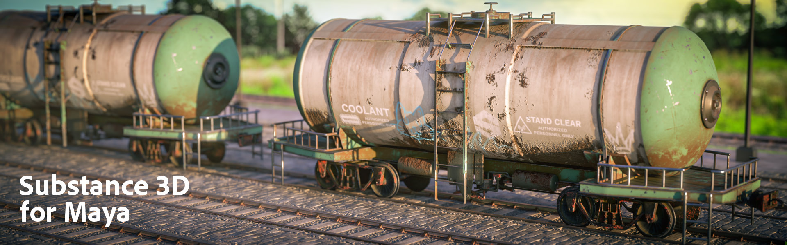

# Maya

## Table of Contents

* [Maya Plugin Release Notes](maya-plugin-release-notes/maya-plugin-release-notes.md)
* [Substance in Maya Overview](in-maya-overview/substance-in-maya-overview.md)
* [Installation](installation/installation.md)
* [Substance Output Node](output-node/substance-output-node.md)
* [Using Workflows](using-workflows/using-workflows.md)
* [Working with Outputs](working-with-outputs/working-with-outputs.md)
* [Procedural Sampling](procedural-sampling/procedural-sampling.md)
* [Presets](presets/presets.md)
* [Settings](settings/settings.md)
* [Arnold Support](arnold-support/arnold-support.md)
* [Apply Workflow To Maps](apply-workflow-to-maps/apply-workflow-to-maps.md)
* [Maya Scripting](maya-scripting/maya-scripting.md)
* [Physical Size in Maya](https://helpx.adobe.com/substance-3d/unlisted/documentation/integrations/232292481.html)
