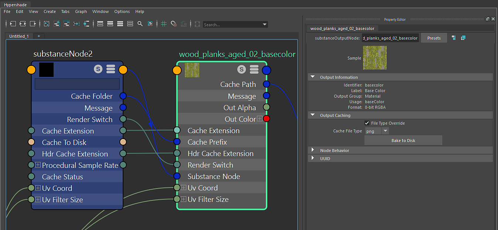

# Substance Output Node

The Substance output node is a reference to the computed texture from the Substance Engine. It is connected to the Substance node. When an output is created on the Substance node, the Substance engine computes the texture and this data is held is RAM. If using the GPU engine, the data is computed on GPU and sent back to memory using the Substance GPU Blend engine. Outputs on the Substance node that are not activated are not computed.

On this node, you can see Output information such as the Identifier, Label and Usage set on the output in Substance Designer. This node also allows you to Bake the texture to disk in the Output Caching section.
