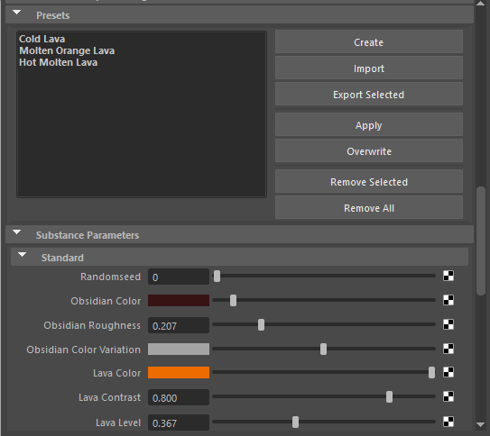

# Presets

In the Presets section, you can fully manage embedded presets found in the Substance sbsar file or create new presets.

To create a preset, make any changes to the Substance Parameters and then click the Create button.

To apply a preset, select the preset from the menu and click Apply. If you need to overwrite a preset, you can select the preset from the menu and click the Overwrite button. This will update the preset with the new settings. You can also import and export Substance preset files (.sbsprs).
