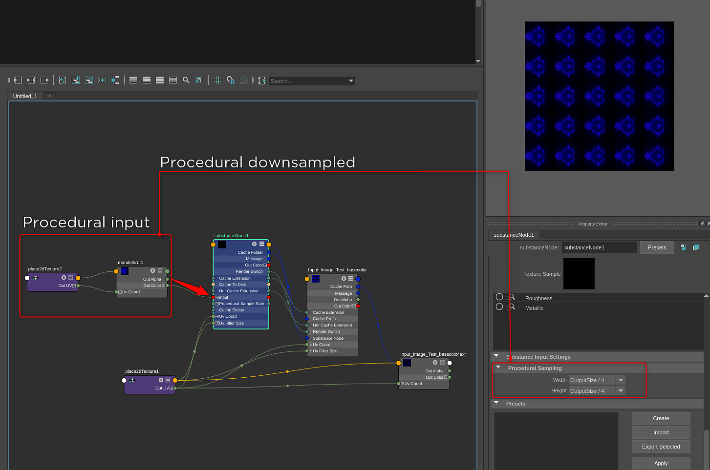

# Procedural Sampling

The procedural sampling settings allow you to control at what size the plugin samples procedural textures such as Browninan, Noise, Fractal, Mandelbrot etc. These settings are specific to Substance Material that has an image input that is using a procedural texture.

