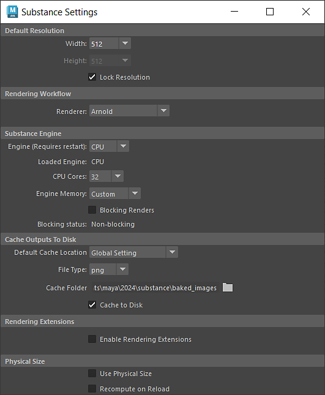

# Settings

The Substance settings menu can be access via the Substance Shelf or the Substance menu. The settings for this menu are stored in an editable configuration file "substance.cfg."

>[!NOTE]
>
> **Config File Locations**
> 
> **Windows**:  
> C:\Users\\Documents\maya\\substance\  
> **MacOS**:  
> /Users//Library/Preferences/Autodesk/maya//substance/  
> **Linux**:  
> /home//maya//substance/

<table>
<tr style="border: 0;">
<td style="border: 0;" valign="top">

## Default Resolution

Sets the default resolution for a Substance node when the sbsar file is loaded.

## Rendering Workflow

Sets the default rendering workflow to use on the Substance node.

## Substance Engine

Setting preferences specific to the Substance Engine and global to all Substance nodes. The Substance engine is used to compute the Substance textures.

### Engine Type

The Substance Engine is available as a CPU and GPU engine. Switching the engine will require restarting Maya. The GPU engine will allow for higher resolutions than the CPU engine.

>[!WARNING]
>
> There can be compute differences between the CPU and GPU engine, so for consistent results, it's best to set the type to the same engine used in Substance Designer.

The CPU Cores and Engine Memory are settings for the amount of resources the Substance engine is allowed to use.

### Blocking Renders

This option allows you to set if the Substance engine compute will block the Maya UI processes. When enabled, the Substance engine will take precedence and block the Maya UI processes. When disabled, the Maya UI processes will not be blocked by Substance engine computations.

## Cache Outputs to Disk

Sets the default cache location, file type and cache folder for all newly created Substance nodes in a project.

## Rendering Extensions

Enable Rendering Extensions to use Substance Outputs directly with Arnold Shaders.

## Physical Size

Enable if Physical Size should be used by default when sbsar files are loaded and if it should be recomputed when reloading the sbsar.

</td>
<td style="border: 0;" valign="top">

</td>
</tr>
</table>
