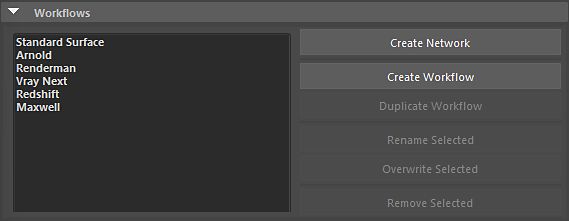
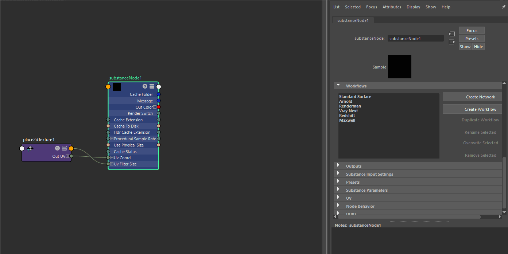
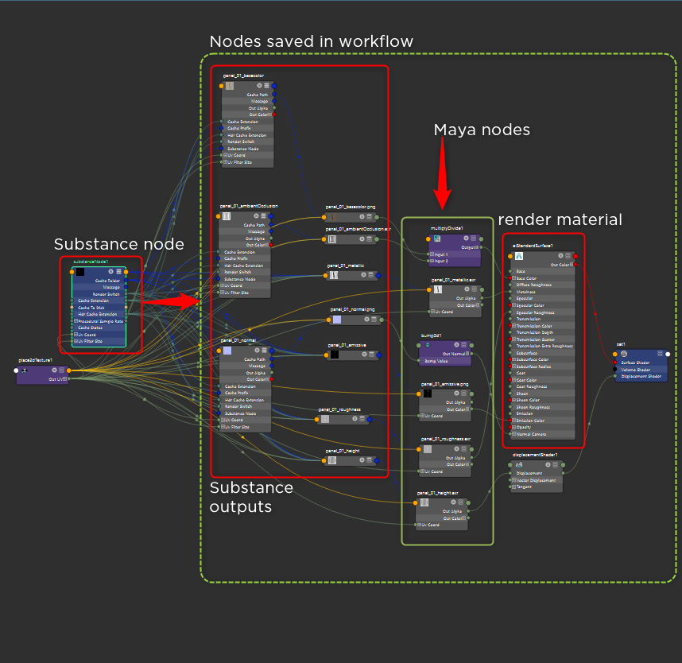

# Using Workflows

Under Workflows, you can choose or create render presets for Substance outputs. These presets are shader networks for a renderer such as Arnold or Vray.

>[!NOTE]
>
> **Workflow Preset Locations**
> 
> **Windows**:  
> C:\Users\\Documents\maya\2022\substance\workflows\generated  
> **MacOS**:  
> /Users//Library/Preferences/Autodesk/maya//substance/workflows/generated  
> **Linux**:  
> /home//maya//substance/workflows/generated

To use a Workflow, simply choose the preset from the drop-down list and then click the Create Shader Network button.

## Creating a Workflow

You can create your own workflow and add it to the Renderer Workflow list. When adding a new workflow, any nodes created after the Substance node will be saved in the workflow. This allows you to create any number of shading nodes to build a complete custom shader network that can be saved as a preset workflow.

##  Managing Workflows

### Saving Custom Workflows

1. Manually create Substance outputs and connect them to a material such as aiStandardSurface.
   1. You can use any Maya or render specific nodes to build the shader network.
1. Click the **Create Workflow** button and enter a name for the workflow preset.

### Duplicating Workflows

You can duplicate a workflow by clicking the **Duplicate Workflow** button.

### Rename and Overwriting Workflows

You can rename existing workflows as well as overwrite workflows with updated data using the **Rename** and **Overwrite** selected buttons.

### Removing Workflows

You can remove existing workflows by using the Remove workflow button.
