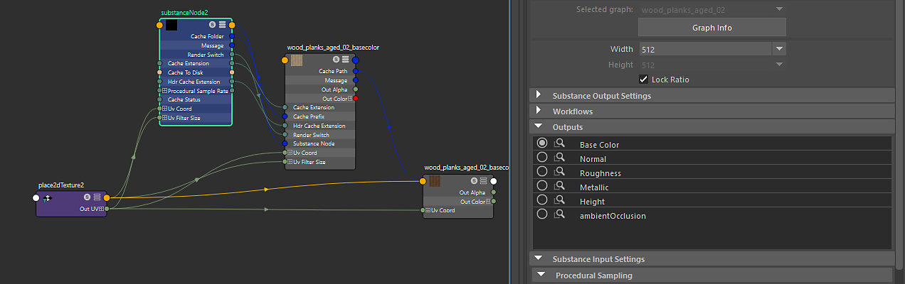
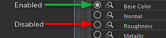

# Working with Outputs

You can enable/disable outputs manually in the Outputs section.

{width="800px"}

A closed circle indicates that the output has been created. In the image above, you can see that the Base Color has been created. Because Cache Outputs to Disk was enabled, a Substance Output was created as well as a Maya file node. The file node reads in the cached texture on disk and is automatically updated whenever the Substance Engine processes the textures. Click on the closed circle again to disable the output and remove the nodes.

Click the eyeglass icon to select the Substance output or the file node. If the file node has been created, it will be selected when clicking the eyeglass icon. If a file node is not present, the Substance output will be selected. This allows you to quickly navigate to an output or file node. *\*Tip: Hit the F key to frame the selected node in the node editor. This is handy when you have many outputs and need to find a specific file node.*
