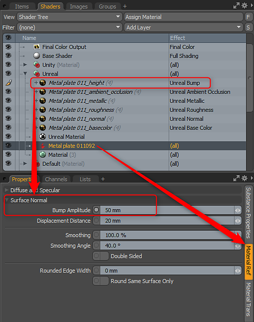
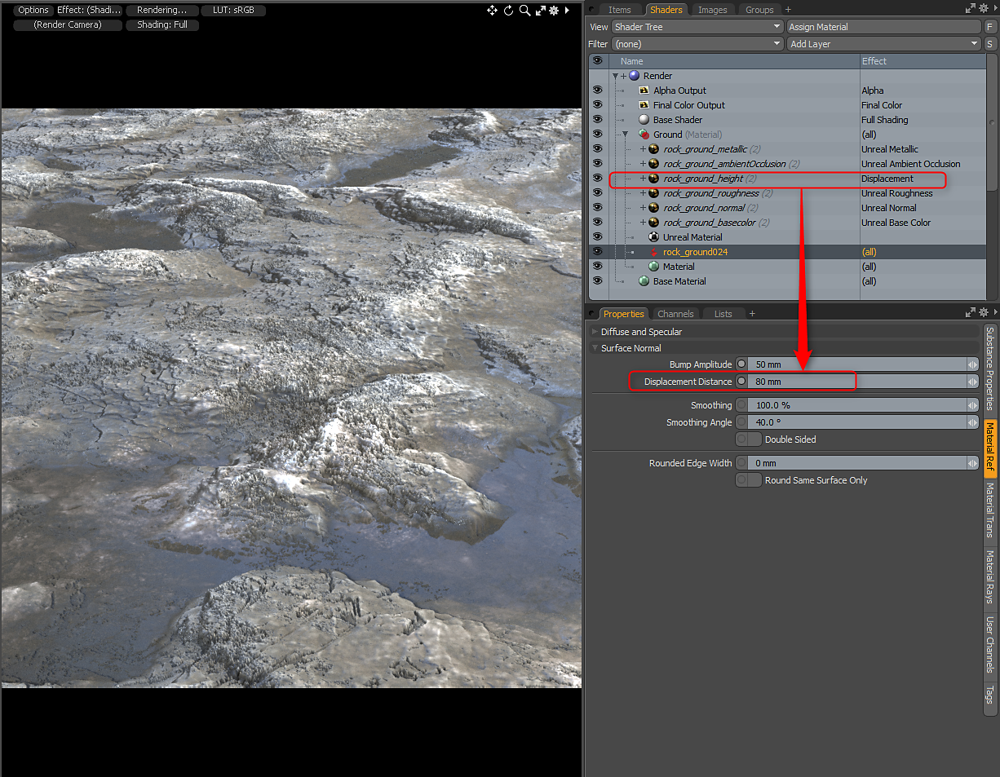

# Bump and Displacement

Working with Bump and Displacement

Substance can have an optional height output. You can use this as displacement or bump. When you enable height it will be set to the bump texture effect. For Unity it will be set to Unity Bump and Unreal will be Unreal Bump. You can then select the Substance Item material and set the Bump Amplitude accordingly. If you would like to use the height as displacement, you can change the Material Layer Effect to Surface Shading &gt; Displacement. Then in the Material Ref, set the appropriate Displacement Distance.

In this example, I used the Unreal material but changed the Unreal Bump Layer Effect to Displacement. Then on the Substance Item Material I set the Displacement Distance and render subdivision level accordingly.

