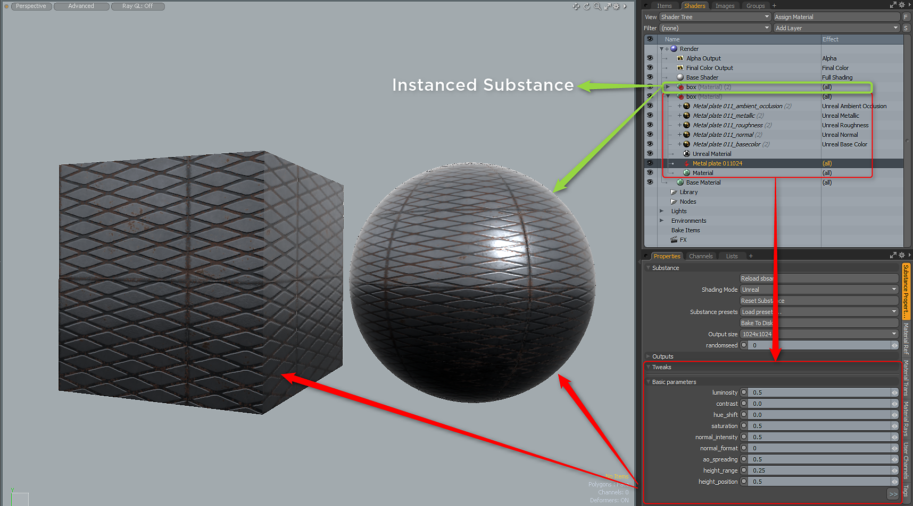

# Copy/Duplicate Substance

## Copy/Instance/Duplicating Substances

## Instancing

To instance a Substance, you need to select the Material Group for the Substance, right-click and choose Instance. This will create a instance of the Substance Material group that can be applied to other meshes. To make changes, you need to adjust the Substance properties on the source Substance item, which is the Substance  
the instances where created from.

## Duplicate

To duplicate a substance, right-click on the substance item and choose duplicate. The substance and the outputs will be duplicated.

## Copy

Copy and paste of a substance item is not supported.
